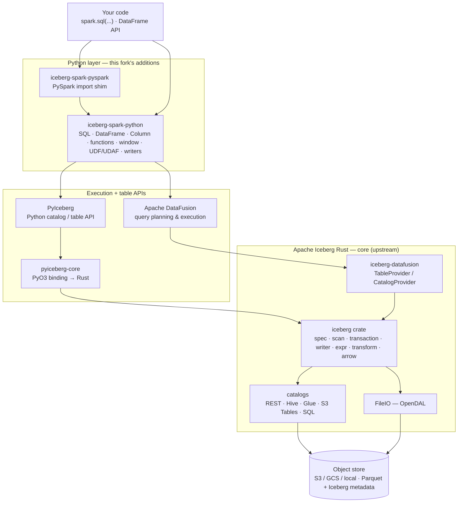

# Apache Iceberg™ Rust — fork with a zero-JVM PySpark layer


A personal fork of [**Apache Iceberg™ Rust**](https://github.com/apache/iceberg-rust) — the Rust
implementation of the [Apache Iceberg](https://iceberg.apache.org/) open table format — extended
with a **pure-Python, zero-JVM drop-in for PySpark's SQL and DataFrame APIs**, built on
[DataFusion](https://datafusion.apache.org/) + [PyIceberg](https://py.iceberg.apache.org/) +
the project's own Rust bindings.

> **This is a fork, not the official project.** It tracks `apache/iceberg-rust` and adds work on
> top; it is independent of and not endorsed by the Apache Software Foundation. The unmodified
> upstream README is preserved at **[README.upstream.md](README.upstream.md)**.

---

## What this fork adds

| Addition | What it is |
|---|---|
| **[`iceberg-spark-python`](iceberg-spark-python/)** | A **pure-Python, zero-JVM replacement for PySpark's SQL/DataFrame interface.** Run `spark.sql(...)` and DataFrame pipelines on a single node with no JVM, no cluster — DataFusion does execution, PyIceberg + the Rust bindings handle catalogs and tables. **900+ tests passing**, ~100% DataFrame API coverage, 170+ built-in functions, UDF/UDAF support, partitioned tables, time travel, and `MERGE INTO`. |
| **[`iceberg-spark-pyspark`](iceberg-spark-pyspark/)** | A thin import shim so existing `from pyspark.sql import SparkSession` code routes to the engine above with no edits. |
| **Agent-engineering harness** | A portable, repo-aware Claude Code harness — [CLAUDE.md](CLAUDE.md), per-model-tier operating manuals under [skills/](skills/), a [testing-discipline gate](docs/testing.md), and a markdown plan/lessons workflow under [task/](task/). |

**Why it's interesting:** the familiar PySpark API without the JVM/Spark operational footprint —
aimed at single-node production analytics, local testing, and data pipelines. See the
[`iceberg-spark-python` README](iceberg-spark-python/README.md) for the full feature matrix.

---

## Architecture

The stack layers a Python query surface over the Rust Iceberg core. Top to bottom: your code calls
a PySpark-shaped API, which executes through DataFusion and resolves tables through PyIceberg and
the Rust bindings, which read and write Iceberg metadata and data over pluggable catalogs and
object storage.



### The Rust core (`crates/iceberg`)

The `iceberg` crate is the source of truth for the on-disk format and the read/write paths:

```
crates/iceberg/src/
├── spec/         table / manifest / schema / snapshot / partition-spec types (the on-disk format)
├── catalog/      the Catalog trait + table identifiers + metadata
├── scan/         table scan planning → Arrow record batches
├── transaction/  atomic metadata updates (append, overwrite, schema change)
├── writer/       data + position/equality delete writers
├── arrow/        Arrow ⇄ Iceberg schema and value conversions
├── io/           object-storage abstraction (OpenDAL-backed FileIO)
├── expr/         predicate / boolean expression trees + binding
├── transform/    partition transforms (identity, bucket, truncate, year/month/day/hour)
├── inspect/      metadata tables (snapshots, manifests)
└── puffin/       Puffin file format (stats / deletion vectors)
```

Design principles to internalize: **the spec module is the source of truth** — changes there ripple
through every reader and writer; **catalogs are pluggable** behind one `Catalog` trait;
**FileIO is pluggable** behind OpenDAL; and **Arrow is the in-memory currency** — scans produce
Arrow batches, writers consume them.

### Workspace crates

| Crate | Role |
|---|---|
| [`iceberg`](crates/iceberg/) | Core: spec, catalog trait, scans, transactions, writers, Arrow/Avro/Parquet IO, expressions, transforms, Puffin. |
| [`iceberg-datafusion`](crates/integrations/datafusion/) | DataFusion `TableProvider` / `CatalogProvider` / physical plans — Iceberg tables queryable from DataFusion SQL. |
| [`iceberg-catalog-{rest,hms,glue,s3tables,sql}`](crates/catalog/) | Concrete `Catalog` implementations. |
| [`iceberg-catalog-loader`](crates/catalog/loader/) | Config-driven catalog construction at runtime. |
| [`iceberg-cache-moka`](crates/integrations/cache-moka/) | Moka-backed object/metadata cache. |
| [`bindings/python`](bindings/python/) (`pyiceberg-core`) | PyO3/maturin Python binding to the Rust core. |

---

## Quick start

### Rust

```rust
// Add to Cargo.toml: iceberg = "0.7", iceberg-catalog-rest = "0.7"
// Load a table through a REST catalog and scan it into Arrow.
let catalog = RestCatalog::new(RestCatalogConfig::builder().uri(uri).build());
let table = catalog.load_table(&TableIdent::from_strs(["db", "events"])?).await?;
let stream = table.scan().select_all().build()?.to_arrow().await?;
```

See [`crates/examples`](crates/examples/) for runnable programs.

### The PySpark-compatible Python layer

```python
from iceberg_spark import IcebergSession  # or: from pyspark.sql import SparkSession (via the shim)

spark = IcebergSession.builder.config("catalog", "rest").getOrCreate()
spark.sql("SELECT symbol, count(*) FROM db.events GROUP BY symbol").show()

df = spark.table("db.events").filter("price > 100").select("symbol", "price")
df.writeTo("db.expensive").createOrReplace()
```

Build the Rust bindings first (`cd bindings/python && maturin develop --release`), then
`pip install -e iceberg-spark-python`. Full instructions:
[`iceberg-spark-python/README.md`](iceberg-spark-python/README.md).

---

## Build & test

```bash
# Rust workspace (entry points in the Makefile)
make build         # cargo build --all-targets --all-features --workspace
make check         # rustfmt --check + clippy -D warnings + taplo + cargo-machete
make test          # doc tests + cargo test --all-targets --all-features --workspace

# Python layer
cd iceberg-spark-python && uv run pytest        # uv run ruff check . / ruff format --check .
```

Toolchain: stable Rust, **MSRV 1.87**, edition 2024 (a pinned nightly drives the fmt/clippy lint
gate). Details and conventions live in [CLAUDE.md](CLAUDE.md).

---

## Repository layout

| Path | What it is |
|---|---|
| [crates/](crates/) | The Rust workspace — `iceberg` core, catalogs, DataFusion integration, examples, tests. |
| [bindings/python/](bindings/python/) | `pyiceberg-core` — the PyO3/maturin Python binding. |
| [iceberg-spark-python/](iceberg-spark-python/) | **Fork:** the zero-JVM PySpark-compatible engine. |
| [iceberg-spark-pyspark/](iceberg-spark-pyspark/) | **Fork:** the PySpark import shim. |
| [CLAUDE.md](CLAUDE.md), [skills/](skills/), [docs/](docs/), [task/](task/) | **Fork:** the agent-engineering harness. |
| [README.upstream.md](README.upstream.md) | The unmodified Apache Iceberg Rust README. |

---

## Development workflow

This fork is developed with a disciplined, repo-aware agent harness ([CLAUDE.md](CLAUDE.md) +
[skills/](skills/)): a Risk-First design checklist, a hard tests-with-every-change gate
([docs/testing.md](docs/testing.md)), strict naming and Rust/Python conventions, and a markdown
plan/lessons workflow ([task/](task/)). The harness is domain-agnostic and portable — see
[skills/map.md](skills/map.md) for how the per-model-tier manuals fit together.

---

## Credits & license

Built on [**Apache Iceberg Rust**](https://github.com/apache/iceberg-rust) by the Apache Iceberg
community (ASF). The `iceberg-spark-python`, `iceberg-spark-pyspark`, and agent-harness directories
are additions in this fork; the Rust crates and Python binding are upstream, tracked closely.

Licensed under the [Apache License, Version 2.0](http://www.apache.org/licenses/LICENSE-2.0) — see
[LICENSE](LICENSE) and [NOTICE](NOTICE). Apache Iceberg, Iceberg, and the Iceberg logo are
trademarks of the Apache Software Foundation.
