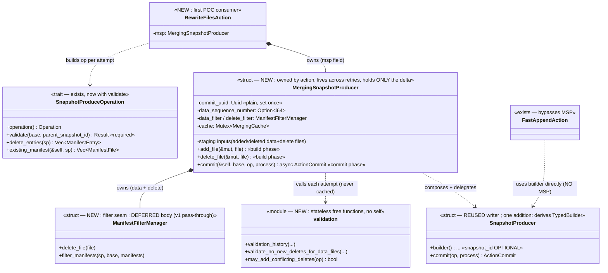

<!--
  Licensed to the Apache Software Foundation (ASF) under one
  or more contributor license agreements.  See the NOTICE file
  distributed with this work for additional information
  regarding copyright ownership.  The ASF licenses this file
  to you under the Apache License, Version 2.0 (the
  "License"); you may not use this file except in compliance
  with the License.  You may obtain a copy of the License at

    http://www.apache.org/licenses/LICENSE-2.0

  Unless required by applicable law or agreed to in writing,
  software distributed under the License is distributed on an
  "AS IS" BASIS, WITHOUT WARRANTIES OR CONDITIONS OF ANY
  KIND, either express or implied.  See the License for the
  specific language governing permissions and limitations
  under the License.
-->

# Design Document: Snapshot Conflict Validation

## 1. Problem Statement

Snapshot production on `main` only supports append-only operations. There is no
machinery for the operations that **remove existing files** from a table — delete,
overwrite, and rewrite. Those operations need two capabilities that append does not:

1. **Write-time conflict validation** — before writing a new snapshot, the commit must
   check the refreshed base table for concurrent changes that would make the pending
   operation incorrect (e.g. a concurrent commit that added delete files for data files
   this operation is about to rewrite). Because the transaction retries against a freshly
   reloaded base, validation must run **on every attempt** against the latest base.
2. **Manifest filtering** — instead of carrying existing manifests forward verbatim, a
   delete-class operation must rewrite manifests to drop the files it removes.

iceberg-java packages all of this into a single `MergingSnapshotProducer` base class via
implementation inheritance (`MergingSnapshotProducer extends SnapshotProducer`). Rust has
no implementation inheritance, so we cannot port that class hierarchy directly.

This document defines the trait/struct structure for that shape. Its focus is the
**`MergingSnapshotProducer`** (hereafter **MSP**) — the object that holds the delta and
drives validate-then-write. Manifest filtering (`ManifestFilterManager`), the remaining
concrete operations (`OverwriteFiles`, `RowDelta`), and the `DeleteFileIndex`
conflict-scoping details are deferred and called out as placeholders. This RFC is derived
from the working spec at `.kiro/specs/snapshot-conflict-validation/design.md`, which
remains the detailed implementation reference.

## 2. Central Idea: Compose and Delegate

The shape is **compose-and-delegate**. The Rust MSP is the translation of Java's
inheritance relationship into **composition**:

> MSP stores **only the delta** between a delete-class operation and the existing
> append-capable `SnapshotProducer`, and **delegates all shared write mechanics** back to a
> `SnapshotProducer` it constructs. Java says `MergingSnapshotProducer extends
> SnapshotProducer`; we say *MSP holds the extra state and hands the writing to a
> `SnapshotProducer` it builds per attempt*.

Nothing about the shared write path is reimplemented. The following **stays in
`SnapshotProducer` and is reused as-is**: snapshot-id / commit-uuid plumbing,
`new_manifest_writer`, `write_added_manifest`, manifest assembly + the `ManifestProcess`
seam, `summary`, manifest-list writing, snapshot build, and `ActionCommit` construction.

The **delta held by MSP** — and only the delta — is the staging inputs (added/deleted data
and delete files, `data_sequence_number`), the stable `commit_uuid`, the lazily-generated
`snapshot_id`, and the two filter managers. Validation is **not** state on MSP: it lives in
a stateless `validation` module of free functions, recomputed against the refreshed base
every attempt.

MSP is **owned by the action as a field**, so it lives across all commit retries and can
cache the stable ids while still recomputing validation every attempt.

Scope:

- Only **delete-class actions** go through MSP. `RewriteFiles` is the first
  proof-of-concept consumer; `OverwriteFiles` and `RowDelta` follow later.
- **FastAppend is not migrated onto MSP.** `FastAppendAction` / `FastAppendOperation` stay
  on the bare `SnapshotProducer`, unchanged. Append removes nothing, so it has no delta to
  hold and no conflict to validate.

## 3. Existing Architecture and Components

The snapshot-production machinery on `main` lives in `transaction/snapshot.rs`,
`transaction/action.rs`, and `transaction/mod.rs`:

- **`SnapshotProducer<'a>`** (`snapshot.rs`) — a per-commit **writer utility** that borrows
  `&'a Table`, created fresh each commit and consumed by `commit<OP, MP>(self, ...)`. It
  owns all the shared write mechanics listed above. It does **not** validate.
- **`SnapshotProduceOperation`** (`snapshot.rs`) — a trait exposing `operation()`,
  `delete_entries()`, and `existing_manifest()`; it customizes which operation type is
  recorded and which existing manifests are carried forward.
- **`ManifestProcess` + `DefaultManifestProcess`** (`snapshot.rs`) — a seam for merge /
  compaction of the manifest set; `DefaultManifestProcess` is a no-op pass-through.
- **`FastAppendOperation`** (`append.rs`) — the only `SnapshotProduceOperation` impl today.
- **`TransactionAction`** (`action.rs`) — `commit(self: Arc<Self>, table: &Table)`. Actions
  are shared immutably behind `Arc<dyn TransactionAction>`; `commit` only gets `&self`.
- **Retry model** (`mod.rs`) — `Transaction::commit` retries `do_commit(&mut self)` via
  `backon`. The **same `Transaction`** — and therefore its
  `actions: Vec<Arc<dyn TransactionAction>>`, with the same `Arc` allocations — persists
  across retries. `do_commit` reloads the table, sets `self.table = refreshed` when stale,
  and re-runs `Arc::clone(action).commit(...)` against the refreshed base each attempt.

The important consequence: **the object that can hold cross-retry state already persists**
(the action's `Arc`). The only thing missing is mutability, because access is `Arc<Self>` /
`&self`. That gap is closed with interior mutability rather than by changing the retry
model. There is no validator, no validation module, and no producer-side validation call
anywhere on `main`.

## 4. Proposed Architecture

The action owns an MSP (the Rust analog of Java's `MergingSnapshotProducer` class). It is
the **stateful, cross-retry** object holding the delta. Each attempt it:

1. runs the operation's `validate` against the current base (stateless free functions;
   never cached),
2. resolves the stable `commit_uuid` (a plain field) and the `snapshot_id` (generated once
   against the base, then cached and reused),
3. composes a fresh per-attempt `SnapshotProducer<'a>` via its derived `TypedBuilder`
   (injecting the stable `commit_uuid` + `snapshot_id`) and **delegates all writing to it**.

This is composition, not inheritance, and delegation, not reimplementation.



### 4.1 Java-to-Rust component mapping

Because the design is a deliberate port of iceberg-java's `MergingSnapshotProducer`, the
mapping below states which Rust component covers each Java responsibility. Java bundles
everything into one inheriting class; Rust spreads the same responsibilities across a small
set of composed pieces.

| iceberg-java (in `MergingSnapshotProducer` / `SnapshotProducer`) | iceberg-rust component | Notes |
| --- | --- | --- |
| `MergingSnapshotProducer extends SnapshotProducer` (inheritance) | `MergingSnapshotProducer` **owns + delegates to** `SnapshotProducer` | composition replaces inheritance |
| Shared write mechanics (`newManifestWriter`, `writeAddedManifest`, manifest assembly, `summary`, manifest-list write, snapshot build) | `SnapshotProducer` (reused as-is) | never reimplemented by MSP or actions |
| `add(DataFile)` staging | `MergingSnapshotProducer::add_file` | routes to data/delete bucket by content type |
| `delete(...)` staging | `MergingSnapshotProducer::delete_file` | routes by content type; also records into the filter manager |
| `setNewDataFilesDataSequenceNumber(...)` | `MergingSnapshotProducer::set_data_sequence_number` | plain MSP field |
| `final commitUUID` | `MergingSnapshotProducer.commit_uuid` (plain field) | set once at construction; needs no locking |
| lazy `snapshotId()` | `MergingCache.snapshot_id` (behind one `Mutex`) | generated once against base, then reused |
| Manifest **filtering** (`ManifestFilterManager`) | `ManifestFilterManager` | **deferred** body in v1 (pass-through placeholder) |
| Manifest **merging** (`ManifestMergeManager`) | existing `ManifestProcess` seam (`DefaultManifestProcess`) | no-op for now; distinct from filtering |
| `validateAddedDeleteFiles`, `validationHistory`, `VALIDATE_ADDED_DELETE_FILES_OPERATIONS` | `validation` module free fns (`validate_no_new_deletes_for_data_files`, `validation_history`, `may_add_conflicting_deletes`) | stateless; recomputed every attempt |
| Per-operation validation hook | `SnapshotProduceOperation::validate` (required trait method) | no-op for append; composed helpers for delete-class ops |
| Retry loop on `SnapshotProducer.commit()` | external retry in `Transaction::do_commit`; MSP is an **action field** with interior mutability | closes the "who survives retries" gap |
| `BaseRewriteFiles.startingSnapshotId` | `RewriteFilesAction.starting_snapshot_id` | action-owned validation lower bound |

### 4.2 On the "Merging" namesake

In iceberg-java, "merging" refers to manifest **merging** — bin-packing many small
manifests into fewer larger ones. In iceberg-rust that concern already has a home in the
existing `ManifestProcess` seam (currently the no-op `DefaultManifestProcess`). Manifest
merging is therefore **distinct** from manifest **filtering** (dropping removed files). Our
MSP borrows the Java name but actually bundles staging + filtering + validation + caching;
actual merging stays the no-op `ManifestProcess` seam for now.

## 5. Proposed Components

### 5.1 `MergingSnapshotProducer` (new — the focus of this RFC)

MSP is owned by the action as a field, so it lives exactly as long as the action's `Arc`,
i.e. across all retries. It holds two state categories:

1. **plain staging fields**, mutated with `&mut self` during the **build** phase
   (`add_file` / `delete_file` / setters), before the action is wrapped in an `Arc`;
2. a **`Mutex<MergingCache>`**, mutated with `&self` during the **commit** phase.

```rust
// NEW — owned by the action, persists across do_commit retries. Holds ONLY the delta.
pub(crate) struct MergingSnapshotProducer {
    // plain, immutable identity (like Java's `final commitUUID`; needs no locking)
    commit_uuid: Uuid,

    // plain staging inputs (mutated with &mut during the BUILD phase)
    snapshot_properties: HashMap<String, String>,
    added_data_files: Vec<DataFile>,
    added_delete_files: Vec<DataFile>,
    deleted_data_files: Vec<DataFile>,
    deleted_delete_files: Vec<DataFile>,
    data_sequence_number: Option<i64>,

    // filter managers (own their per-manifest rewrite behavior; body deferred, see 5.5)
    data_filter: ManifestFilterManager,
    delete_filter: ManifestFilterManager,

    // ALL mutable cross-retry state behind ONE mutex
    cache: std::sync::Mutex<MergingCache>,
}

struct MergingCache {
    // Generated lazily against the base on the first attempt (collision-checked), then
    // reused every attempt. Mirrors Java's lazy snapshotId(). The ONLY interior-mutable
    // cross-retry state in v1.
    snapshot_id: Option<i64>,
    // TODO(future): filter_cache: HashMap<String, CachedRewrite> — deferred rewrite cache.
}
```

Staging mutators route files to the data-vs-delete bucket by content type (as in `#1606`);
`delete_file` also records the removal into the matching filter manager during the
`&mut self` build phase, so the later filtering pass needs only a shared `&self` borrow:

```rust
impl MergingSnapshotProducer {
    pub(crate) fn new(commit_uuid: Uuid, snapshot_properties: HashMap<String, String>) -> Self { /* ... */ }

    /// Mirrors Java `MergingSnapshotProducer.add(...)`.
    pub(crate) fn add_file(&mut self, file: DataFile) {
        match file.content_type() {
            DataContentType::Data => self.added_data_files.push(file),
            _ => self.added_delete_files.push(file),
        }
    }

    /// Mirrors Java `MergingSnapshotProducer.delete(...)`.
    pub(crate) fn delete_file(&mut self, file: DataFile) {
        match file.content_type() {
            DataContentType::Data => { self.data_filter.delete_file(file.clone()); self.deleted_data_files.push(file); }
            _ => { self.delete_filter.delete_file(file.clone()); self.deleted_delete_files.push(file); }
        }
    }

    // set_data_sequence_number / set_commit_uuid / set_snapshot_properties + read accessors
}
```

**The DRY validate-then-write entry point.** Called once per attempt by the action, against
the freshly refreshed `base`. Takes `&self`; the cache mutates through the interior `Mutex`.
Discipline: the guard is **never held across an `.await`** — lock → decide → clone out →
unlock → async IO.

```rust
impl MergingSnapshotProducer {
    pub(crate) async fn commit<OP, MP>(&self, base: &Table, operation: OP, process: MP)
        -> Result<ActionCommit>
    where OP: SnapshotProduceOperation, MP: ManifestProcess {
        let parent_snapshot_id = base.metadata().current_snapshot_id();

        // 1. Validation ALWAYS runs against the current base. Never cached.
        operation.validate(base, parent_snapshot_id).await?;

        // 2. Resolve snapshot_id once against the base (collision-checked), then reuse.
        //    Lock briefly; NO IO under the guard.
        let snapshot_id = {
            let mut cache = self.cache.lock().unwrap();
            *cache.snapshot_id
                .get_or_insert_with(|| SnapshotProducer::generate_unique_snapshot_id(base))
        };

        // 3. Compose a fresh per-attempt writer with the stable commit_uuid + snapshot_id
        //    injected, and delegate. ALL shared write mechanics live in SnapshotProducer.
        let producer = SnapshotProducer::builder()
            .table(base)
            .snapshot_id(Some(snapshot_id))
            .commit_uuid(self.commit_uuid)
            .snapshot_properties(self.snapshot_properties.clone())
            .added_data_files(self.added_data_files.clone())
            .build();
        producer.commit(operation, process).await
    }
}
```

This is the **middle link in a three-layer delegation chain**, each on a different receiver
— an accepted, deliberate cost of composition:

```text
TransactionAction::commit          (self: Arc<Self>)
  -> MergingSnapshotProducer::commit   (&self)     // validate + resolve ids + build producer
    -> SnapshotProducer::commit        (mut self)  // shared write mechanics, reused as-is
```

**Interior-mutability rationale.** All mutable cross-retry state lives behind the single
`Mutex<MergingCache>` — not scattered per-field cells. In v1 the cache holds only the
lazily-generated `snapshot_id`; the one-mutex shape is kept deliberately so a deferred
filter-rewrite cache has a home. There is effectively zero lock contention (actions and
retries run sequentially); the `Mutex` exists to satisfy `Sync` and provide safe interior
mutation, not for concurrency.

**Lifetime rationale (Java vs Rust).** In Java the retry loop lives on
`SnapshotProducer.commit()`, so the producer object naturally persists across retries and
holds caches directly. In Rust the retry loop is external (`Transaction::do_commit`), so the
per-attempt writer is created fresh each time. That is why the stateful object must be an
**action field with interior mutability** — it is the only thing that survives the external
retry loop. `commit(self: Arc<Self>, table)` mutates the cache through the `Mutex`, never
through `&mut self`.

### 5.2 `SnapshotProduceOperation` (existing trait — `validate` added)

A single trait for all operations. `validate` is a **required** method (no default body);
every operation states its validation policy explicitly. `existing_manifest` keeps its
`&self` receiver.

```rust
pub(crate) trait SnapshotProduceOperation: Send + Sync {
    fn operation(&self) -> Operation;

    /// Write-time conflict validation against the refreshed base. REQUIRED. Append
    /// (FastAppend) implements it as an explicit no-op; delete-class operations compose the
    /// stateless `validation::*` helpers. Called by `MergingSnapshotProducer::commit` every
    /// attempt; never cached.
    fn validate(&self, base: &Table, parent_snapshot_id: Option<i64>)
        -> impl Future<Output = Result<()>> + Send;

    fn delete_entries(&self, sp: &SnapshotProducer<'_>)
        -> impl Future<Output = Result<Vec<ManifestEntry>>> + Send;

    fn existing_manifest(&self, sp: &mut SnapshotProducer<'_>)
        -> impl Future<Output = Result<Vec<ManifestFile>>> + Send;
}
```

`FastAppendOperation` gains only the no-op `validate` (append removes nothing, so it has no
conflict to detect) and continues to drive `SnapshotProducer` directly, bypassing MSP.

### 5.3 `validation` module (new — stateless free functions)

The reusable conflict checks are **free functions**, not trait methods — no `self`, no
trait. They take `&Table`, snapshot ids, and data files, and are pure with respect to the
caller. Keeping them free keeps the operation trait lean; delete-class operations compose
them from `validate`, and results are recomputed against the refreshed base every attempt
(never cached). Bodies are ported from `#2590`.

```rust
// NEW module: transaction/validation.rs

/// Replaces the old `VALIDATE_ADDED_DELETE_FILES_OPERATIONS` static set: which snapshot
/// operations may introduce conflicting deletes. Overwrite/Delete => true.
pub(crate) fn may_add_conflicting_deletes(operation: Operation) -> bool {
    matches!(operation, Operation::Overwrite | Operation::Delete)
}

/// Collect manifests + snapshot ids added between two points, filtered by an operation
/// predicate and manifest content type. Walks `ancestors_between(to, from)` and asserts
/// last-ancestor consistency.
pub(crate) async fn validation_history(
    base: &Table,
    from_snapshot_id: Option<i64>,
    to_snapshot_id: i64,
    matching_operations: impl Fn(Operation) -> bool,
    content_type: ManifestContentType,
) -> Result<(Vec<ManifestFile>, HashSet<i64>)> { /* ... */ }

/// Fail if any delete added since `from_snapshot_id` targets any of the given data files.
/// Builds a `DeleteFileIndex` (sender scoped so the channel closes and we do not deadlock),
/// scoped by `starting_sequence_number`. When `ignore_equality_deletes` is true, only
/// positional deletes count as conflicts. Short-circuits to Ok for V1 tables / no current
/// snapshot (delete files exist only in V2+).
pub(crate) async fn validate_no_new_deletes_for_data_files(
    base: &Table,
    from_snapshot_id: Option<i64>,
    to_snapshot_id: Option<i64>,
    data_files: &[DataFile],
    ignore_equality_deletes: bool,
) -> Result<()> { /* ... */ }
```

### 5.4 `SnapshotProducer` (existing — one change: derived builder)

Stays the per-attempt writer utility and keeps every piece of shared write machinery. The
**only** change is that construction moves onto a **derived** builder: `SnapshotProducer`
gains `#[derive(TypedBuilder)]`, following the crate convention (`Snapshot`,
`PartitionField`, `ViewVersion`, etc. all derive `typed_builder::TypedBuilder`).
`snapshot_id` becomes an `Option<i64>` marked `#[builder(default)]`:

- **`None`** (default) → the id is generated (collision-checked) at use/commit time — the
  old `new()` behavior. The **append path** builds this way.
- **`Some(id)`** → the caller's id is used verbatim. **MSP** builds this way, injecting the
  pinned id so it stays stable across retries.

`generate_unique_snapshot_id(&Table)` is exposed so MSP can generate the id once and cache
it. Everything else in `SnapshotProducer` is unchanged and reused. Stability of both the
`commit_uuid` and the `snapshot_id` across retries is what prevents orphaned manifest-list
files (the manifest-list path embeds both).

### 5.5 `ManifestFilterManager` (new — filter seam, body deferred)

> **Deferred in v1.** This RFC focuses on MSP. `ManifestFilterManager` is introduced as the
> filter seam MSP owns (one for data manifests, one for delete manifests), but its
> **rewrite body is a placeholder / pass-through** for now, and **v1 has no cross-retry
> rewrite cache** — it always rewrites. The single `Mutex<MergingCache>` shape on MSP is
> retained precisely so the deferred cache has a home when filter caching lands.

The shape is only sketched here: a concrete struct that records files to drop (keyed by
file path; `DataFile` covers both data and delete files) via `delete_file`, and rewrites
carried-forward manifests via `filter_manifests(&self, sp, base, manifests)`. MSP partitions
carried-forward manifests by content type and routes each partition to the appropriate
manager. The real rewrite body (drop `deleted_files`, re-emit survivors) and the rewrite
cache are future work.

### 5.6 Action wiring

Delete-class actions own an MSP field and route all their staging through it; the append
action does neither.

```rust
// Delete-class action: owns MSP as a field (survives retries via the action's Arc).
pub struct RewriteFilesAction {
    msp: MergingSnapshotProducer,
    starting_snapshot_id: Option<i64>, // action-owned validation lower bound
}

#[async_trait]
impl TransactionAction for RewriteFilesAction {
    async fn commit(self: Arc<Self>, table: &Table) -> Result<ActionCommit> {
        // Three-layer delegation. MSP runs validate then the write; no copy-pasted
        // validate-then-write, no closure.
        self.msp
            .commit(table, self.build_operation(), DefaultManifestProcess)
            .await
    }
}

// FastAppendAction is unchanged: no MSP, no validate override — it builds a
// SnapshotProducer directly and drives FastAppendOperation.
```

## 6. First Consumer (Proof of Concept): `RewriteFiles`

`RewriteFiles` is the first concrete consumer wired through MSP, and today it is a
**proof-of-concept**, not a finished operation — it exercises the compose-and-delegate seam
end to end while the filter body and the remaining delete-class operations are still
placeholders. It replaces a set of existing files with a new, equivalent set (compaction)
in a single `Replace` snapshot, and validates that no conflicting row-level deletes have
appeared for the rewritten data files since the starting snapshot. The reference behavior is
`#1606`; the content-type split, the empty-delete precondition, and the
`ignore_equality_deletes = data_sequence_number.is_some()` flag come from it.

The action owns the MSP and forwards staging into it. Only the action-owned
`starting_snapshot_id` stays local; it is copied into a fresh operation each attempt:

```rust
impl RewriteFilesAction {
    pub(crate) fn new() -> Self {
        Self {
            msp: MergingSnapshotProducer::new(Uuid::now_v7(), HashMap::default()),
            starting_snapshot_id: None,
        }
    }

    /// Forwarded into MSP, which routes each file by content type.
    pub fn add_files(mut self, files: impl IntoIterator<Item = DataFile>) -> Result<Self> {
        for f in files { self.msp.add_file(f); }
        Ok(self)
    }
    pub fn delete_files(mut self, files: impl IntoIterator<Item = DataFile>) -> Result<Self> {
        for f in files { self.msp.delete_file(f); }
        Ok(self)
    }

    pub fn set_starting_snapshot_id(mut self, id: i64) -> Self { self.starting_snapshot_id = Some(id); self }
    pub fn set_data_sequence_number(mut self, seq: i64) -> Self { self.msp.set_data_sequence_number(seq); self }

    /// Fresh operation per attempt, borrowing the durable MSP; only starting_snapshot_id is
    /// copied, so nothing stale leaks between attempts.
    fn build_operation(&self) -> RewriteFilesOperation<'_> {
        RewriteFilesOperation { msp: &self.msp, starting_snapshot_id: self.starting_snapshot_id }
    }
}

pub(crate) struct RewriteFilesOperation<'a> {
    msp: &'a MergingSnapshotProducer,
    starting_snapshot_id: Option<i64>,
}

impl SnapshotProduceOperation for RewriteFilesOperation<'_> {
    fn operation(&self) -> Operation { Operation::Replace }

    async fn delete_entries(&self, _sp: &SnapshotProducer<'_>) -> Result<Vec<ManifestEntry>> {
        Ok(vec![]) // removals happen by rewriting carried-forward manifests, not delete entries
    }

    async fn validate(&self, base: &Table, parent_snapshot_id: Option<i64>) -> Result<()> {
        // Precondition (intent from #1606): a rewrite must remove something.
        if self.msp.deleted_data_files().is_empty() && self.msp.deleted_delete_files().is_empty() {
            return Err(Error::new(ErrorKind::DataInvalid, "Files to delete cannot be empty"));
        }
        // Scan for conflicting deletes only when data files are rewritten. A pinned
        // data_sequence_number means only positional deletes count as conflicts (#1606).
        if !self.msp.deleted_data_files().is_empty() {
            let ignore_equality_deletes = self.msp.data_sequence_number().is_some();
            validation::validate_no_new_deletes_for_data_files(
                base,
                self.starting_snapshot_id,
                parent_snapshot_id,
                self.msp.deleted_data_files(),
                ignore_equality_deletes,
            )
            .await?;
        }
        Ok(())
    }

    async fn existing_manifest(&self, sp: &mut SnapshotProducer<'_>) -> Result<Vec<ManifestFile>> {
        // A Replace with no current snapshot is an error, not an empty result.
        let Some(snapshot) = sp.table.metadata().current_snapshot() else {
            return Err(Error::new(
                ErrorKind::PreconditionFailed,
                "Cannot rewrite files: table has no current snapshot",
            ));
        };
        let base = sp.table;
        let manifests = base.manifest_list_reader(snapshot).load().await?.entries().to_vec();
        // MSP partitions by content type and runs the data / delete filter managers
        // (v1 filter body is a placeholder; see 5.5).
        self.msp.filter_existing_manifests(sp, base, manifests).await
    }
}
```

This POC exercises the MSP path end to end: the action holds the MSP field (cross-retry) and
forwards staging during build; `MSP::commit` runs `validate` against the current base every
attempt, resolves the stable ids, and delegates all writing to a fresh `SnapshotProducer`;
and `FastAppend` uses the same unified trait with an explicit no-op `validate`, bypassing MSP
entirely.

## 7. Correctness Properties

Phrased as testable invariants (this is a design-only document):

1. **Validation is never cached.** Every attempt runs `operation.validate(...)` against the
   *refreshed* base; the result is never memoized. N retries against N bases ⇒ N validations.
2. **`validate` is an explicit no-op for append.** `FastAppendOperation::validate` is
   `Ok(())`; append performs no conflict validation and never fails on validation grounds.
3. **Stable identity across retries.** For a given commit, the `commit_uuid` (plain field)
   and `snapshot_id` (lazily generated, then cached) observed on attempt *k* equal those on
   attempt 0. The common retry path creates **no manifest-LIST orphans** (the path embeds
   both, with a fixed `attempt = 0`, so retries overwrite the same path).
4. **Replace with no current snapshot errors.** A `Replace`/rewrite against a table with no
   current snapshot returns an error and produces no snapshot (enforced in
   `existing_manifest`).
5. **No lock held across `await`.** No `Mutex` guard on `MergingCache` is held across a
   manifest-IO `.await`: lock → decide → clone out → unlock → async IO → lock → store.

## 8. Error Handling

- **Replace with no current snapshot** — `existing_manifest` returns an Iceberg error
  (`PreconditionFailed`, "Cannot rewrite files: table has no current snapshot") rather than
  an empty result.
- **Empty delete set** — `validate` returns `DataInvalid` ("Files to delete cannot be
  empty").
- **Validation conflict** — `validate_no_new_deletes_for_data_files` returns `DataInvalid`
  when a new conflicting delete file is found, **before any write** on that attempt.
- **Summary generation for `Replace`** — `update_snapshot_summaries` must allow
  `Operation::Replace`; otherwise summary generation fails for a rewrite snapshot. This is a
  required supporting change.

## 9. Deferred / Future Work

- **`ManifestFilterManager` rewrite body.** The real drop-and-re-emit rewrite is future
  work; v1 is a pass-through placeholder (see 5.5).
- **Cross-retry rewrite cache.** A cache of rewritten manifests keyed by input manifest path
  is deferred. In v1 the filter manager always rewrites, so retries whose rewrite output
  differs may leave **rewritten-manifest orphans** — an accepted, storage-only v1 limitation
  (committed metadata stays correct; orphans are removable by existing orphan-file / expire
  tooling). The single-`Mutex` `MergingCache` shape reserves a home for this cache.
- **Transaction-level post-commit cleanup sweep.** Porting Java's full orphan cleanup needs
  a post-commit hook that sees the winning snapshot's manifest set. In Rust that cannot live
  on the action (`TransactionAction::commit` never observes the catalog outcome); it must
  live at the transaction layer. Future work.
- **Remaining delete-class operations.** `OverwriteFiles` and `RowDelta` follow `RewriteFiles`
  through the same MSP path.
- **Known validation limitation.** `get_deletes_for_data_file` does not yet check
  positional-delete applicability by path, which can yield false-positive conflicts without a
  pinned `starting_sequence_number`. To be addressed later.
