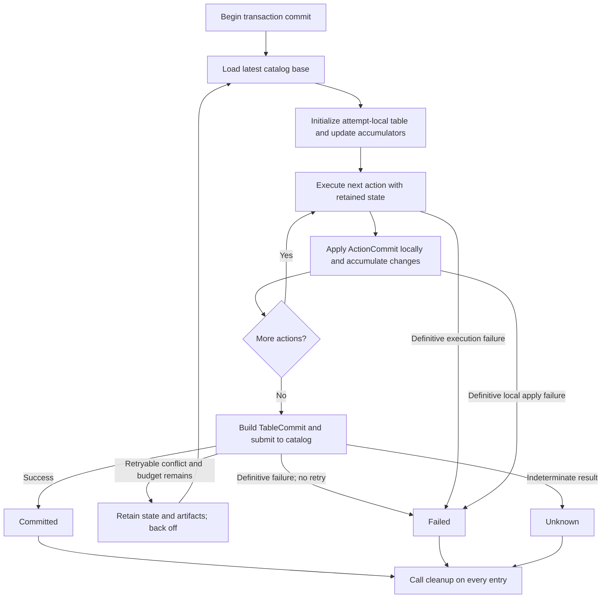

<!--
  Licensed to the Apache Software Foundation (ASF) under one
  or more contributor license agreements.  See the NOTICE file
  distributed with this work for additional information
  regarding copyright ownership.  The ASF licenses this file
  to you under the Apache License, Version 2.0 (the
  "License"); you may not use this file except in compliance
  with the License.  You may obtain a copy of the License at

    http://www.apache.org/licenses/LICENSE-2.0

  Unless required by applicable law or agreed to in writing,
  software distributed under the License is distributed on an
  "AS IS" BASIS, WITHOUT WARRANTIES OR CONDITIONS OF ANY
  KIND, either express or implied.  See the License for the
  specific language governing permissions and limitations
  under the License.
-->

# RFC: Stateful Transactions and Snapshot Production

**Status:** Draft  
**Target:** Apache Iceberg Rust (`iceberg-rust`)

## 1. Motivation and Scope

Replaying transaction actions after a catalog conflict is sufficient for simple
metadata updates, but snapshot-producing actions benefit from retaining work
across attempts. FastAppend and merging operations such as RowDelta need stable
execution identity, reusable metadata processing, and ownership of generated
files that may require cleanup.

This RFC establishes a stateful action model and a shared foundation for snapshot
production. The transaction owns catalog refresh and replay; each action execution
owns retry-persistent state; snapshot-producing actions use persistent producers
as that state.

The proposal fixes lifetimes, ownership, the core action interface, and the
responsibilities of snapshot producers. It does not prescribe cache layouts,
conflict-validation predicates, or the complete semantics of each operation.
Those can be implemented incrementally within these boundaries.

## 2. Transaction and Action State Model

### 2.1 Three Lifetimes

| Lifetime | Responsibility |
| --- | --- |
| Transaction | Catalog refresh, retry policy, action ordering, replay, and the terminal result |
| Action execution | Immutable operation intent and exclusively owned retry-persistent state |
| Attempt | Execution against the current transaction-local table and construction of that attempt's result |

An action's intent does not change during replay. Its state survives attempts of
one logical execution, while values derived from a particular base are local to
an attempt or reused only under an appropriate validity check.

### 2.2 Stateful Action Interface

Each action declares an associated state type. The following interface captures
the lifecycle; the heterogeneous storage adapters are implementation details.

```rust
#[async_trait]
pub(crate) trait TransactionAction: Send + Sync + 'static {
    type State: Send + Sync + 'static;

    /// Fresh state for one logical execution; infallible and table-independent.
    fn new_state(&self) -> Self::State;

    /// One attempt against the current transaction-local table.
    async fn commit(
        &self,
        state: &mut Self::State,
        table: &Table,
    ) -> Result<ActionCommit>;

    /// Best-effort cleanup after the transaction reaches a terminal result.
    async fn cleanup(
        &self,
        _state: &mut Self::State,
        _table: &Table,
        _status: CommitStatus,
    ) {}
}
```

The action is borrowed immutably, its execution state mutably, and the table per
attempt. Stateless actions use `State = ()`. State is created when an action is
added to a transaction. Table-dependent initialization happens during execution;
once resolved, logical snapshot identity remains stable across retries.

`CommitStatus` describes terminal cleanup safety (§6). Neither the action nor its
state needs to control the transaction's catalog retry loop.

The action interface and its storage machinery remain `pub(crate)`: external
crates cannot define transaction actions, so the erasure and adapter details
are internal rather than public API commitments.

### 2.3 Action Entries and Cloning

A transaction stores one entry per action, pairing immutable intent with its
execution state. Conceptually:

```rust
struct ActionEntry<A: TransactionAction> {
    action: Arc<A>,
    state: A::State,
}
```

The transaction must preserve that pairing when storing heterogeneous entries.
A typed entry erased behind an adapter and separately erased action/state values
with a checked pairing are both acceptable implementations.

Retry reuses the same entry state. Cloning a transaction creates a new execution
of the action plan: it may share immutable actions, but creates fresh state via
`new_state()`. Mutable retry state and generated execution identity are not shared
between transaction executions.

## 3. Retry and Replay Workflow

`Transaction::commit` owns refresh, retry, and replay. Each attempt starts from a
catalog base, executes actions in application order, and submits their combined
updates and requirements as one `TableCommit`.



Later actions observe earlier actions' transaction-local results, even though
none of those results has yet been committed to the catalog. After a conflict,
the next attempt rebuilds the local table from the refreshed base and replays
the complete action sequence. It does not continue accumulating changes on the
previous attempt's local result.

The diagram omits refresh errors and other error branches for clarity. The
transaction/catalog layer determines retryability and whether a failed request
definitively did not commit. An unresolved catalog outcome is `Unknown`; it must
not be treated as a known conflict or definite failure.

Replaying an action does not require repeating all of its I/O or metadata
processing. The same persistent state is passed into each attempt, allowing the
action to reuse valid work while producing a new result for the current base.

## 4. Persistent Snapshot Producers

### 4.1 Producers as Action State

Snapshot-producing actions use persistent producers as their associated state:

| Producer | Role | Initial consumer |
| --- | --- | --- |
| `SimpleSnapshotProducer` | Append-shaped snapshot production | `FastAppendAction` |
| `MergingSnapshotProducer` | Snapshot production involving data/delete file additions and removals | `RowDeltaAction` |

An action expresses operation intent and selects the checks required by its
semantics and configuration. The producer supplies reusable validation and
metadata-processing capabilities, retains work across retries, and constructs
the snapshot result for an attempt.

The producers are independent concrete types, not an inheritance hierarchy.
`MergingSnapshotProducer` does not contain `SimpleSnapshotProducer`. Each producer
owns the persistent state needed for its responsibilities; the transaction does
not need to know that an action's state is a producer.

### 4.2 Shared Snapshot Production

Common mechanics are shared through stateless helpers: snapshot-ID generation,
metadata path generation, summary construction, manifest-list writing, and
snapshot/update/requirement assembly. These helpers operate on explicit inputs
and do not own retry state or select operation policy.

This replaces the attempt-scoped producer and generic hook-trait pipeline with
concrete producers and shared functions. Identity, path allocation, reuse, and
artifact ownership remain producer responsibilities. Whether common persistent
fields are extracted into a shared struct is an implementation choice.

### 4.3 From Action Intent to a Snapshot

Snapshot production has three logical stages. These describe responsibilities,
not a requirement to put all stages into one `apply()` method.

1. **The action selects and invokes validation.** For example, a RowDelta action
   may require referenced files to remain live or reject conflicting changes
   since a starting snapshot. The producer provides shared validation capabilities
   and reusable history processing; the action determines which checks apply.
   The concrete conflict predicates are outside this RFC.

2. **The producer prepares the resulting manifests.** It obtains the current
   transaction-local manifest set, applies removals through manifest filtering,
   generates or reuses manifests for additions, and assembles the complete
   resulting set. Filtering updates manifest entries to reflect file removals;
   it does not read Parquet files to execute row-level deletes. Unaffected
   manifests can be retained, and valid transformation results can be reused.

3. **The producer constructs the attempt's snapshot.** It determines parent,
   sequence number, applicable row-ID allocation, and summary from the current
   table and resulting changes. It writes an attempt-specific manifest list and
   returns an `ActionCommit`. The transaction applies that result locally and
   eventually submits the combined `TableCommit`.

For example, if the current set is `M1, M2`, an action removes a file described
by `M1` and adds file `X`, the producer may produce `M1′, M2, MX`: `M1′` reflects
the removal, `M2` is unchanged, and `MX` describes the addition. Manifest filter
managers and history-processing helpers support this workflow without defining
the public action semantics themselves.

## 5. Reuse Across Attempts

> Retries recompute base-dependent snapshot composition, while reusing previously
> completed work whenever all semantic inputs that produced it remain unchanged.

### 5.1 Retained Work and Attempt-Specific Results

| Work or state | Behavior across retry/rebase |
| --- | --- |
| Action intent and resolved logical identity | Preserve for the execution |
| Added manifests and per-manifest transformation results | Reuse while all relevant inputs remain unchanged |
| Metadata reads and processed validation history | Reuse under the same semantic validity rule |
| Parent, sequence number, and row-ID allocation | Determine from the current attempt's table |
| Complete resulting manifest set and snapshot summary | Recompute for the current attempt |
| Manifest list, `ActionCommit`, and `TableCommit` | Construct for the current attempt |

The main reuse opportunities are expensive reads, decoding, and manifest
materialization. Reconstructing the complete manifest set does not require
discarding those results, nor does it prohibit caching the current snapshot's
input manifests under an appropriate identity.

An immutable file is a useful reuse boundary, but file identity alone is not
necessarily the full semantic input to a computation. Operation intent, relevant
metadata context, and inherited values must also remain compatible. Each attempt
must establish its required validation coverage and current-state checks; cached
history or an earlier successful check cannot substitute for that obligation.

This RFC identifies reuse opportunities without requiring a particular cache
inventory, key type, or storage layer. Correct recomputation is an acceptable
fallback whenever reuse cannot be established safely.

One assumption deserves explicit statement because it is format-dependent.
Reusing a generated added manifest across attempts is valid under current
formats because the attempt-sensitive values — committing snapshot ID, data
sequence number, first-row-id — are inherited through manifest-list metadata
rather than embedded in the manifest file, so a rebase changes what the
manifest inherits without invalidating its content. A future format that
embeds base-dependent values directly into manifests would add those values
to the manifest's semantic inputs and shrink this reuse accordingly. That is
a seam inside producers and their writers; it changes what may be reused, not
the ownership, replay, or cleanup architecture.

### 5.2 Logical Identity Versus Snapshot Representation

A stable snapshot ID identifies one logical snapshot-producing execution. It
does not imply that an uncommitted snapshot's representation is stable across
attempts.

In a multi-action transaction, action B can observe a snapshot produced locally
by action A. After rebase, A retains its snapshot ID but may produce a different
parent, sequence number, manifest set, and manifest-list location. B must use
that new representation.

Committed snapshots have immutable representations. Transaction-local snapshots
must instead be treated as attempt-dependent until committed. Any reuse involving
them must be guarded by the relevant representation or semantic inputs, or the
work must be recomputed. Snapshot ID alone is insufficient for that purpose.

### 5.3 Multi-Action Replay Example

Consider A appending file X and B removing a file described by manifest M1.
Assume the relevant transformation inputs remain compatible across the rebase,
and a concurrent commit adds an unrelated manifest M3.

| Stage | First attempt | After rebase |
| --- | --- | --- |
| Catalog base | `M1, M2` | `M3, M1, M2` |
| A: append X | Write `MX`; assemble `MX, M1, M2` | Reuse `MX`; assemble `MX, M3, M1, M2` |
| B: remove file | Transform `M1 → M1′`; retain `MX, M2` | Reuse valid results for `M1, MX, M2`; evaluate `M3` |
| B: resulting set | `MX, M1′, M2` | `MX, M3, M1′, M2` if M3 is unaffected |
| Snapshot construction | A and B each write a manifest list | A and B each write a new manifest list |

A and B replay in full, but neither necessarily rewrites its materialized
manifests. B consumes A's current output, not A's previous attempt's complete
manifest set. If relevant inputs change or validation finds a conflict, the
affected work is recomputed or the action fails according to its semantics.

## 6. Artifact Ownership and Terminal Cleanup

Producers create metadata before catalog commit succeeds. Each producer must
track its generated artifacts, including those written by owned helper
components. Caller-provided data or delete files do not become producer-owned
merely because the action references them.

Generated metadata paths are write-once: a new attempt must not overwrite files
from an earlier attempt. Reused artifacts keep their existing paths. Artifacts
are retained during retry and considered for cleanup only when the transaction
reaches a terminal result.

```rust
#[derive(Debug, Clone, Copy, PartialEq, Eq)]
pub(crate) enum CommitStatus {
    /// The catalog confirmed that the commit was applied.
    Committed,
    /// The transaction definitively did not commit and will not retry.
    Failed,
    /// The commit request was submitted, but its outcome could not be
    /// resolved: the catalog may or may not have applied it.
    ///
    /// Example: every action executed and validated successfully, but the
    /// connection failed while awaiting the catalog's response to
    /// `update_table`.
    Unknown,
}
```

| Status | Meaning | Cleanup |
| --- | --- | --- |
| `Committed` | The transaction committed successfully | Retain owned artifacts needed by the committed result; clean up the rest |
| `Failed` | The transaction definitively did not commit and will not retry | Clean up owned artifacts |
| `Unknown` | The catalog may have committed, but the result is unresolved | Delete nothing |

The transaction/catalog layer determines this classification. Producers consume
it rather than independently interpreting catalog errors. Once the retry loop
terminates, every entry receives `cleanup`, including entries that wrote
files before a later action failed.

For `Committed`, the supplied table reflects the accepted metadata and supports
reachability checks. Cleanup must account for all snapshots and references
retained by the committed transaction, not only its final current snapshot; if
reachability cannot be established safely, cleanup retains the artifact.
For `Failed`, no reachability reasoning is required: the transaction
definitively did not commit, so producer-owned artifacts are deletable.
For `Unknown`, the supplied table is available execution context only — it is
not proof that the commit failed or that a potentially committed artifact is
unreachable — and cleanup deletes nothing.

`Unknown` arises only at the catalog boundary, after local work has succeeded:
the commit request was submitted, but its result could not be verified — for
example, a network failure while awaiting the catalog's response. The catalog
layer should make a best-effort attempt to resolve the true outcome before
reporting `Unknown` (for example through idempotent request handling or by
re-checking table state), so `Unknown` is a last resort, not a routine result.
When it is reported, the transaction fails with an error and must not be
retried: retrying could commit a second time if the original request landed,
and cleaning up could delete metadata that is now live.

Cleanup is best-effort and must not change the already-determined transaction
result. Failures are reported without turning a successful commit into a failed
one. Process crashes and abandoned transactions may still leave orphans; orphan
cleanup remains the safety net. Resolving unknown catalog outcomes is deferred.

## 7. Alternatives Considered

**Attempt-scoped producer borrowing a separate retry-state struct.** An earlier
draft kept the producer attempt-scoped and had it borrow a long-lived
retry-state bundle owned by the action entry. Field-for-field, that bundle
converges on exactly what a persistent producer holds, while adding a borrow
split and a second struct. The persistent producer expresses the same boundary
more simply: its fields are retry-persistent, and values derived from one base
are locals of one attempt or validity-guarded cache entries.

**Java-style producer inheritance and hook traits.** The previous attempt-scoped
`SnapshotProducer` used hook traits (`SnapshotProduceOperation`,
`ManifestProcess`) to let operations inject behavior into a generic pipeline —
a template-method pattern standing in for Java's class hierarchy. With concrete
sibling producers whose attempt logic owns the pipeline and takes operation
inputs as arguments, the hooks have no remaining role, and no base type or
internal locking is needed.

**Producer-typed action state.** `TransactionAction::State` could have been
bounded by a snapshot-producer trait. But many actions are stateless or not
snapshot-producing, and no transaction-level code needs to know that a state is
a producer: replay calls `commit`, terminal cleanup calls `cleanup`, both on
the action. A generic `State` subsumes the producer case without vacuous impls.

## 8. Adoption Plan and Deferred Decisions

### 8.1 Implementation Plan

Implement the architecture incrementally along its dependency boundaries:

1. **Stateful actions and replay.** Introduce the associated state, action-entry
   ownership, and fresh-state cloning. Migrate stateless actions with `State = ()`
   and verify that retry retains state while rebuilding attempt-local results.

2. **Persistent simple snapshot production.** Extract stateless helpers,
   introduce `SimpleSnapshotProducer`, and migrate FastAppend. Remove the old
   attempt-scoped producer and obsolete hook traits once consumers are migrated.

3. **Merging and artifact lifecycle.** Introduce `MergingSnapshotProducer`,
   manifest filtering, and reusable added-manifest production. Integrate terminal
   status reporting and cleanup for both producers.

4. **Validation capabilities.** Add reusable history processing and shared
   validation operations. Specify concrete predicates and their semantics in
   companion work.

5. **End-to-end operations.** Wire RowDelta intent and validation controls into
   the producer, then extend to other snapshot operations. Verify multi-action
   replay, changed transaction-local snapshot representations, valid manifest
   reuse, and cleanup under success, definite failure, and unknown outcomes.

These are implementation milestones, not mandatory one-to-one PR boundaries.
The goal is to establish and exercise the shared architecture through concrete
operations, without requiring every optimization or operation up front.

### 8.2 Deferred Implementation Decisions

The following do not need to be fixed to agree on this architecture:

- Shared state structs such as `CommitIdentity`, and eager/lazy UUID generation.
- Cache representations, keys, bounds, eviction, and placement in lower layers.
- Manifest-filter internals and per-spec bookkeeping.
- Conflict predicates, isolation levels, and operation-specific validation APIs.
- Manifest merging/organization and reuse of those results.
- Whole-attempt reuse, unknown-outcome resolution, REST idempotency integration,
  and cross-process retry state.

Implementations may evolve these details while preserving the lifecycle,
ownership, replay, reuse, and cleanup boundaries defined above.
