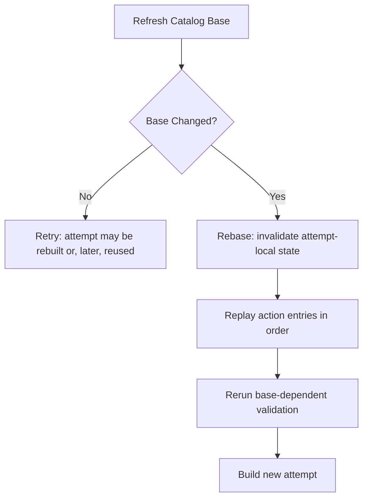
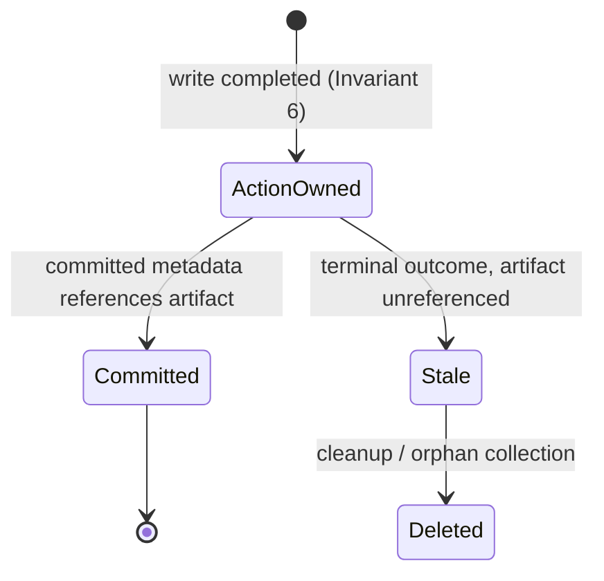

<!--
  Licensed to the Apache Software Foundation (ASF) under one
  or more contributor license agreements.  See the NOTICE file
  distributed with this work for additional information
  regarding copyright ownership.  The ASF licenses this file
  to you under the Apache License, Version 2.0 (the
  "License"); you may not use this file except in compliance
  with the License.  You may obtain a copy of the License at

    http://www.apache.org/licenses/LICENSE-2.0

  Unless required by applicable law or agreed to in writing,
  software distributed under the License is distributed on an
  "AS IS" BASIS, WITHOUT WARRANTIES OR CONDITIONS OF ANY
  KIND, either express or implied.  See the License for the
  specific language governing permissions and limitations
  under the License.
-->

# RFC: Stateful Transaction

**Status:** Draft
**Target:** Apache Iceberg Rust (`iceberg-rust`)
**Scope:** Transaction/action lifecycle, state ownership, snapshot identity, retry and rebase semantics, conflict validation, merging snapshot execution, artifact lifecycle, and table format version evolution

## Abstract

This RFC proposes a state and lifecycle model for snapshot-producing transaction
actions. It separates what an action *means* (immutable configuration), what an
action may *keep* across commit attempts (retry-persistent state, including a
stable snapshot identity), and what must be *recomputed* from every refreshed
table base (attempt-local state). The design is carried by five artifacts: the
missing infrastructure on current `main`, one code block, one lifetime table,
one worked trace, and one invariant list. Everything else is rationale.

---

# 1. Motivation

## 1.1 The missing retry infrastructure

On current `main`, actions are stored as `Arc<dyn TransactionAction>` and
committed through `commit(self: Arc<Self>, table)`. `Transaction::do_commit`
refreshes the table, replays every action, and submits; a retry re-enters the
same loop with a fresh replay. This is sufficient for metadata-only actions and
for fast append.

Merging operations — overwrite, rewrite-files, delete, and row-delta — are
blocked on three pieces this loop does not have:

1. **No place to hold state across commit attempts.** `commit` receives
   `Arc<Self>`, so an action cannot obtain `&mut self`; it cannot carry
   anything from one attempt to the next — not a stable snapshot identity, not
   a record of completed work, nothing.
2. **No boundary for conflict validation.** A merging operation must validate
   the refreshed base on every attempt (did a concurrent commit add delete
   files for data files this rewrite removes?). Nothing today defines which
   validation inputs may be kept across attempts and which results must be
   recomputed on a new base — there is no correct place to put validation at
   all.
3. **No owner for metadata written before the commit lands.** A merging
   operation writes manifests before `catalog.update_table` is called. When an
   attempt fails — or when the outcome is ambiguous — no layer owns those
   files, knows whether they are referenced, or is responsible for their
   cleanup or reuse.

This RFC supplies exactly those three pieces: typed retry-persistent state per
action entry (section 2.2), a lifetime partition that gives validation its
keep/recompute boundary (section 2.3), and an artifact ownership model
(section 6).

## 1.2 Evidence: the gap already costs something today

Even fast append pays for the missing infrastructure. Every replay constructs
a fresh `SnapshotProducer`, which generates a fresh `snapshot_id` and (unless
the action pinned one) a fresh `commit_uuid` — and both are embedded in the
names of the files each attempt writes:

```text
{commit_uuid}-m0.avro                            # manifest
snap-{snapshot_id}-{attempt}-{commit_uuid}.avro  # manifest list
```

```text
attempt 1:  writes U1-m0.avro, snap-S1-0-U1.avro   → catalog conflict
attempt 2:  fresh IDs S2/U2
            writes U2-m0.avro, snap-S2-0-U2.avro   → success
```

Attempt 1's files are never referenced and never deleted: **every retry
orphans the previous attempt's entire metadata output.** This is checkable
today by forcing a conflict between two appends and listing the metadata
directory — and, inverted, it is the acceptance test for Phase 2.

---

# 2. Design

Two principles frame everything that follows:

> **Transaction and action state is partitioned by lifetime: action-lifetime
> configuration and identity versus attempt-lifetime values derived from the
> current base. Snapshot-processing state is partitioned by which action kind
> is running — fast append versus merging operations — and by Iceberg table
> format version — V1–V3 today, V4 later.**

> **Snapshot identity belongs to the logical snapshot action; parentage,
> sequence allocation, validation, and final metadata belong to the current
> attempt.**

## 2.1 Retry versus rebase

The lifetime table below depends on these two definitions, so they come first.

**Retry** — another catalog submission against the *same* base:

```text
build attempt from S10 → submission fails → refresh → still S10
```

**Rebase** — refresh observes a *different* base:

```text
our base: S10 → concurrent commit S10→S11 → refresh: S11
```



The first implementation may rebuild the attempt even when the base is
unchanged; the distinction must still exist in the model, because the two cases
invalidate different things. Same-base whole-attempt reuse is possible later,
and is deliberately left as future work: most retryable catalog failures are
conflicts, which change the base anyway.

## 2.2 The proposal in one code block

```rust
/// Marker for state an action may keep across transaction attempts.
pub(crate) trait TransactionActionState: Send + 'static {}

/// Metadata-only actions keep nothing.
impl TransactionActionState for () {}

/// Stable identity of one logical snapshot-producing action.
/// Generated once at apply time; never changes afterwards.
pub(crate) struct SnapshotActionState {
    snapshot_id: i64,     // Iceberg snapshot identity (spec-level)
    commit_uuid: Uuid,    // artifact namespace (implementation-level)
}
impl TransactionActionState for SnapshotActionState {}

/// State for merging snapshot actions (overwrite / rewrite-files / delete /
/// row delta). Identity is embedded, not flattened: non-merging snapshot
/// actions use `SnapshotActionState` directly, and no `Option` is needed.
pub(crate) struct MergeState {
    snapshot: SnapshotActionState,

    /// The first concrete reusable field, populated in Phase 6 and `None`
    /// until then: manifests written for the action's added files. Writing
    /// them is base-independent (section 5.2, step 3), so they survive
    /// rebases — sound only because the embedded identity is stable: the
    /// files land under the unchanging `commit_uuid`, and in table format
    /// V1 they carry the unchanging `snapshot_id`.
    added_file_manifests: Option<Vec<ManifestFile>>,
}
impl TransactionActionState for MergeState {}

#[async_trait]
pub(crate) trait TransactionAction: Sync + Send + 'static {
    type State: TransactionActionState;

    /// Called once, when the action is applied to the transaction.
    /// Snapshot-producing actions generate and collision-check their
    /// snapshot identity here, against the table known at apply time.
    fn new_state(&self, table: &Table) -> Result<Self::State>;

    /// Called once per attempt, against the refreshed transaction-local table.
    async fn commit(&self, state: &mut Self::State, table: &Table)
        -> Result<ActionCommit>;
}

/// Typed pairing: an action cannot be stored with the wrong state type.
struct TransactionActionEntry<A: TransactionAction> {
    action: A,
    state: A::State,
}

/// Object-safe erasure of the complete typed entry. No downcast exists
/// anywhere: the Action→State association is fixed before erasure.
#[async_trait]
pub(crate) trait DynTransactionActionEntry: Send {
    async fn commit(&mut self, table: &Table) -> Result<ActionCommit>;
}

#[async_trait]
impl<A: TransactionAction> DynTransactionActionEntry for TransactionActionEntry<A> {
    async fn commit(&mut self, table: &Table) -> Result<ActionCommit> {
        self.action.commit(&mut self.state, table).await
    }
}

pub struct Transaction {
    table: Table,
    actions: Vec<Box<dyn DynTransactionActionEntry>>,
}

// Each action names its own state:
// impl TransactionAction for UpdatePropertiesAction { type State = ();                  ... }
// impl TransactionAction for FastAppendAction       { type State = SnapshotActionState; ... }
// impl TransactionAction for RewriteFilesAction     { type State = MergeState;          ... }
```

Reading only this block tells you the proposal: actions are stored with typed,
retry-persistent state; snapshot-producing actions keep a stable identity in
that state; the erasure happens around the *pair*, so no runtime downcast
exists; `new_state` receives the table so identity can be collision-checked at
initialization.

Logical action configuration stays on the action itself and never changes after
apply:

```rust
struct RewriteFilesAction {
    files_to_add: Vec<DataFile>,
    files_to_delete: Vec<DataFile>,
    starting_snapshot_id: Option<i64>,
    conflict_detection_filter: Option<Expression>,
}
```

`ApplyTransactionAction::apply` builds the entry, which is the single point
where `new_state(table)` runs:

```rust
impl<A: TransactionAction> ApplyTransactionAction for A {
    fn apply(self, mut tx: Transaction) -> Result<Transaction> {
        let state = self.new_state(tx.table())?;
        tx.actions.push(Box::new(TransactionActionEntry { action: self, state }));
        Ok(tx)
    }
}
```

### Snapshot identity semantics

The two identity fields answer different questions. `snapshot_id` answers *"which
Iceberg snapshot is this?"* — it is spec-level, appears in the committed
`Snapshot`, participates in ancestry and references, and is embedded in table
format V1 manifest entries (V2+ defer it via snapshot-id inheritance, a
mechanism designed precisely so manifests need not be rewritten when a commit
is retried). `commit_uuid` answers *"which logical producer execution wrote
these files?"* — it is implementation-level and only namespaces generated
artifact paths. Keeping both stable means an artifact created by an earlier
attempt never needs to be renamed simply because the parent snapshot changed —
which is what makes the one base-independent pipeline step reusable at all
(section 5.2).

**Collision policy.** `snapshot_id` is generated once in `new_state`,
collision-checked against the table's existing snapshots at that moment, then
preserved. The random space is ~2^62, so a concurrent writer independently
committing the same ID after our check is vanishingly unlikely; regenerating on
a later collision would invalidate already-generated ID-dependent metadata, so
the initial policy is generate-once-preserve — matching Java's producer-lifetime
behavior. `TableMetadataBuilder::add_snapshot` already rejects duplicate IDs, so
an undetected collision fails the commit rather than corrupting metadata.

## 2.3 The lifetime table

This table is canonical. Every later claim of the form "X is attempt-local" is
a row here, not a new rule.

| Value | Owner | Retry (same base) | Rebase (new base) |
|---|---|---|---|
| Action configuration (files to add/delete, starting snapshot, conflict filter, snapshot properties) | Action | preserve | preserve |
| `ActionState` (incl. embedded `SnapshotActionState`) | ActionEntry | preserve | preserve¹ |
| Added-file manifests (`MergeState`, Phase 6) | ActionEntry | preserve | preserve (base-independent; §5.2 step 3) |
| Catalog base / transaction-local table | Attempt | reuse while same | replace / rebuild |
| Parent snapshot | Attempt | reuse while same | recompute |
| Sequence number | Attempt | reuse while same | recompute |
| First row ID / row range | Attempt | reuse while same | recompute |
| Validation history and result | Attempt | reuse while same | recompute |
| Filtered / organized manifest set, metadata root | Attempt | reuse while same | rebuild |
| Updates / requirements / `TableCommit` | Attempt | reuse while same | rebuild |

¹ "Preserve" for `ActionState` means *safe contents*: state records only
completed, reusable work (Invariant 6). The embedded snapshot identity
(`snapshot_id`, `commit_uuid`) is the part that must **never** change for the
life of the applied action.

The central rule:

> **A base change invalidates base-dependent attempt state, not the logical
> action, its identity, or its state.**

---

# 3. Invariants

Each invariant is one sentence and maps to a test. A claim that cannot be
phrased this way belongs in Rationale, not here.

1. **Fresh validation.** Conflict validation runs against every refreshed base
   and its result is never reused across attempts.
   *Test:* validation passes on attempt 1; a concurrent conflicting commit
   lands; attempt 2 fails validation before writing.
2. **No attempt-local carryover.** No parent snapshot, sequence number, row ID,
   validation result, or `TableCommit` built against base *N* is used in an
   attempt against base *M ≠ N*.
   *Test:* the worked trace (section 4) asserted end-to-end after a forced
   rebase.
3. **Stable identity.** `snapshot_id` and `commit_uuid` observed on attempt *k*
   equal those observed on attempt 1, for every attempt of one applied action.
   *Test:* capture identity per attempt across retry and rebase; assert equal;
   assert generated metadata paths share one namespace.
4. **Stable intent.** An action's configuration is identical on every attempt.
   *Test:* staged file sets and validation configuration compared across
   attempts.
5. **Ordering.** Action *B* observes the transaction-local result of *A* on
   every attempt, and no action refreshes the catalog itself.
   *Test:* A→B→C transaction where B reads A's effect; repeat after rebase.
6. **Record-after-complete.** Persistent state records an artifact only after
   the write completed.
   *Test:* inject a write failure; assert state contains no reference to the
   failed artifact and the next attempt proceeds correctly.
7. **Failure does not orphan eagerly.** A failed catalog submission alone does
   not delete or invalidate artifacts written by the action.
   *Test:* fail attempt 1; assert its artifacts still exist when attempt 2
   runs (reuse is allowed but not required).
8. **Unknown outcome deletes nothing.** After an ambiguous catalog response, no
   artifact cleanup runs until the outcome is resolved via refreshed metadata.
   *Test:* mock catalog returns timeout after persisting; assert no deletions;
   assert next refresh finding `snapshot_id` in metadata resolves to success.
9. **Identity initialization is checked.** `new_state` collision-checks the
   generated `snapshot_id` against the table it receives.
   *Test:* seed a table containing a forced ID; assert generation avoids it.
10. **Validation precedes I/O.** A merging attempt that fails conflict
    validation writes no metadata files.
    *Test:* force a conflicting concurrent commit; assert the failing attempt
    produced zero files in the metadata directory.

Invariants 1, 2, 5, and 10 are the conflict-correctness core. Invariants 3, 6,
7, and 8 are the artifact-lifecycle core. If an implementation satisfies all
ten, the lifetime table is being enforced.

---

# 4. Worked Trace

One rebase, every value, whether it changed and why. This trace is the
normative illustration; sections 5–6 refer to its rows rather than re-deriving
them.

```text
Setup   table at S10 (last sequence 10, next row id 5000)
        rewrite action applied:
            files_to_delete = [f1, f2]      (action config)
            files_to_add    = [f3]          (action config)
            new_state(table@S10):
                snapshot_id = 91827364      collision-checked against S10
                commit_uuid = 8ac3f9…       generated once

Attempt 1  (base S10)
        parent_snapshot_id = 10             derived from base
        sequence_number    = 11             derived from base
        first_row_id       = 5000           derived from base
        validation         starting-snapshot → S10 window: no conflicts
        writes             8ac3f9…-m0.avro (rewritten manifest)
                           8ac3f9…-m1.avro (added-files manifest)
                           snap-91827364-…-8ac3f9….avro (manifest list)
        TableCommit        requirement: main == S10
        catalog            CommitFailedException   (concurrent S10 → S11)

Refresh    base is now S11  →  REBASE

Attempt 2  (base S11)
        snapshot_id        = 91827364       UNCHANGED   (ActionState)
        commit_uuid        = 8ac3f9…        UNCHANGED   (ActionState)
        files to add/del   = [f1,f2]/[f3]   UNCHANGED   (action config)
        parent_snapshot_id = 11             CHANGED     (attempt-local)
        sequence_number    = 12             CHANGED     (attempt-local; 11 was
                                                         consumed by S11)
        first_row_id       = 5200           CHANGED     (attempt-local; S11
                                                         advanced next-row-id)
        validation         starting-snapshot → S11 window: RERUN, now also
                           covers S11's changes        (attempt-local)
        metadata           regenerated against S11; the initial implementation
                           recomputes everything, though the added-files
                           manifest (step 3, base-independent) is the Phase 6
                           reuse target; artifacts land under the SAME
                           8ac3f9… namespace
        TableCommit        REBUILT: requirement: main == S11
        catalog            success — committed snapshot 91827364, parent 11
```

Two rows deserve the emphasis. `snapshot_id` did not change because it is a
random logical identifier, not a content hash: reparenting the same logical
snapshot from S10 to S11 changes what it *contains*, not which snapshot it
*is* (Java behaves identically: one producer, one ID, many attempts).
`sequence_number` did change because sequence numbers are allocated from table
metadata and S11 consumed 11; preserving the ID never implies preserving any
base-derived value.

---

# 5. Snapshot Execution

## 5.1 Delegation: `MergingSnapshotProducer` composes `SnapshotProducer`

> `MergingSnapshotProducer` **composes** a `SnapshotProducer` rather than
> inheriting from one (in Java, `MergingSnapshotProducer extends
> SnapshotProducer`); it is **attempt-scoped** — constructed fresh inside the
> action's `commit` on every attempt — and holds **no retry-persistent state**
> of its own. "Merging" names the four actions that use it — overwrite,
> rewrite-files, delete, and row-delta — which must merge their changes into
> the table's existing manifests; it does not mean manifest
> merging/compaction, which is merely step 4 of its pipeline.

The relationship is delegation, not callback: the merging layer drives the
pipeline, and the generic producer is an inner field it calls.

```rust
struct MergingSnapshotProducer<'a> {
    // Borrowed action configuration (immutable — Invariant 4):
    added_files: &'a [DataFile],
    deleted_files: &'a [DataFile],
    starting_snapshot_id: Option<i64>,
    conflict_detection_filter: Option<&'a Expression>,

    // Retry-persistent state (mutable — Invariant 6 governs writes):
    state: &'a mut MergeState,

    // The generic producer it delegates to — an inner field, not a base class:
    producer: SnapshotProducer<'a>,
}
```

This shape requires splitting the existing `SnapshotProducer::commit` into a
contents-deciding half and a finalization half — real Phase 2 work, not a
cosmetic rename:

```rust
impl<'a> SnapshotProducer<'a> {
    /// Attempt context derived from the fresh table. Promoted to a concrete
    /// struct because the merging layer needs it directly: the parent
    /// snapshot for filtering (step 2) and the sequence number for
    /// delete-file handling.
    fn attempt_context(&self) -> Result<SnapshotAttemptContext>;

    /// Finalization half — the single public path to a committed-shape
    /// snapshot. Accepts an already-decided manifest set and summary; writes
    /// the manifest list, builds the `Snapshot`, and produces the
    /// `TableUpdate`s and `TableRequirement`s.
    async fn finalize(self, produced: ProducedSnapshot) -> Result<ActionCommit>;
}

/// The interface the whole composition rests on.
struct ProducedSnapshot {
    /// Snapshot operation type recorded in the summary
    /// (`Append`, `Overwrite`, `Delete`, `Replace`).
    operation: Operation,
    /// The complete manifest set of the new snapshot.
    manifests: Vec<ManifestFile>,
    /// Built from the actual result, not from the action's intent (step 5).
    summary: SnapshotSummary,
}

struct SnapshotAttemptContext {
    parent_snapshot_id: Option<i64>,
    sequence_number: i64,
    first_row_id: i64,
}
```

`FastAppendAction` routes through the same two-step path — decide contents
(write added-file manifests, carry every existing manifest forward by
reference) then `finalize(ProducedSnapshot)` — so exactly **one finalization
path** exists for all snapshot-producing actions.

## 5.2 The five steps of the merging pipeline

In order. Validation runs first, before any I/O, so a conflicting attempt
fails without writing a single file (Invariant 10).

1. **Validate** against the refreshed base: walk the history from
   `starting_snapshot_id` to the current parent and reject the attempt if a
   concurrent commit conflicts with the merging operation (for a rewrite: new
   delete files targeting the data files being rewritten).
2. **Filter** existing manifests: drop entries for deleted files, rewriting
   only the affected manifests and carrying untouched manifests forward by
   reference; fail if a named deleted file is absent from every manifest —
   deleting a file that does not exist is a logic error, not a no-op.
3. **Write added-file manifests** from `added_files`.
4. **Organize** the combined manifest set (e.g. bin-pack small manifests).
5. **Summarize** from the actual resulting contents — the filtered, written,
   and organized set — never from the action's intent.

| Step | Base-dependent? | Why |
|---|---|---|
| 1. Validate | yes | the conflict window ends at the refreshed base's current snapshot |
| 2. Filter | yes | operates on the refreshed base's manifest list |
| 3. Write added-file manifests | **no** | written from `added_files` alone; in table format V2+ the data sequence number is inherited from the manifest-list entry, so nothing in the file depends on the base |
| 4. Organize | yes | its inputs include step 2's output |
| 5. Summarize | yes | summarizes the actual merged result |

Step 3's base-independence is what gives `MergeState` its first concrete field
(`added_file_manifests`) and defines Phase 6's scope precisely: cache exactly
the step 3 output, recompute everything else. It is also the strongest
motivation for stable identity: the one reusable step is reusable *only*
because its files land under an unchanging `commit_uuid` and, in table format
V1, carry an unchanging `snapshot_id` in their entries. Regenerate either
value per attempt and even this step becomes unreusable.

## 5.3 Producer responsibilities

`SnapshotProducer` stays attempt-scoped and thin. It receives identity instead
of generating it, and derives the attempt context from the fresh table:

```rust
struct SnapshotProducer<'a> {
    table: &'a Table,
    // Supplied by ActionState — never generated per attempt:
    snapshot_id: i64,
    commit_uuid: Uuid,
    // parent_snapshot_id / sequence_number / first_row_id are derived from
    // `table` (attempt rows of the table in §2.3) via attempt_context().
    snapshot_properties: HashMap<String, String>,
    manifest_counter: RangeFrom<u64>,
}
```

Its responsibilities: derive the attempt context, write the metadata root
appropriate for the table format version, build the `Snapshot`, and emit
updates/requirements as an `ActionCommit`. It never understands rewrite,
overwrite, or delete semantics — those live one layer up.

## 5.4 The three table-format-version seams

When the table format version changes, exactly three layers change. All three
sit below the action boundary; the transaction and action lifecycle touches
none of them.

1. **Metadata generation** — writing new metadata for added and removed
   content. (Today: manifest writing; pipeline step 3.)
2. **Metadata reading and filtering** — loading the current snapshot's
   metadata and dropping or rewriting entries. (Today: manifest-list reading
   and manifest filtering; pipeline step 2.)
3. **Metadata organization and finalization** — arranging results and writing
   the snapshot's metadata root. (Today: manifest merging and manifest-list
   writing; pipeline step 4 and `finalize`.)

Everything above the seams is independent of table format version by
construction: `Transaction`, the entries, `TransactionActionState` ownership,
snapshot identity, retry versus rebase, action ordering, the validation
lifecycle, and the artifact lifecycle. `snapshot_id` is spec-level and survives
any table format version; `commit_uuid` names artifacts regardless of what
those artifacts are. `MergeState` stays opaque to the transaction precisely so
a future table format version can put entirely different reusable state behind
the same boundary.

V4 is still in flux, so this RFC deliberately claims nothing about *what* V4
changes — only *where* such changes land: in the three seams. The success
criterion is falsifiable:

> Supporting a new table format version may replace metadata generation,
> reading/filtering, and organization/finalization, but must not require
> redesigning `Transaction`, the stateful entries, snapshot identity
> ownership, or retry/rebase semantics.

---

# 6. Artifact Lifecycle

## 6.1 The mechanism

Snapshot actions write metadata files **before** `catalog.update_table` is
called — that ordering is inherent, since the commit must reference the files.
The consequence: when the catalog response is ambiguous (timeout, transport
error after send), the commit may have landed, and the just-written artifacts
may already be referenced by the live table. Deleting referenced metadata
corrupts a committed table silently; leaking unreferenced files costs storage
and is recoverable. Every rule below follows from that asymmetry.



## 6.2 The three terminal outcomes

| Outcome | Artifact policy |
|---|---|
| **Confirmed success** | Retain artifacts the committed snapshot references; delete unreferenced artifacts from earlier attempts of the same action. |
| **Confirmed failure** | Delete all artifacts the action wrote — none can be referenced. |
| **Unknown** | Delete **nothing**. |

## 6.3 Resolving the unknown outcome

An unknown outcome is not permanently unknown. On the next refresh, the table
metadata either contains our stable `snapshot_id` or it does not:

```text
refresh
  ├── snapshot_id present  → the commit landed → confirmed success
  └── snapshot_id absent   → the commit did not land → confirmed failure
```

This check only works because the identity is stable: with per-attempt IDs
there is nothing durable to look for. Alongside added-file manifest reuse
(section 5.2) — the strongest motivation for stable identity — this resolution
path is a second, independent argument, and it is why identity stability is
Invariant 3 rather than an optimization note. (Java, lacking a place to
re-enter, surfaces `CommitStateUnknownException` and stops; the stable
identity gives Rust the option to do better.)

## 6.4 What remains is an orphan

Any artifact whose owner never reached a terminal outcome (process death,
abandoned transaction) is an ordinary orphan file, handled by existing
orphan-file cleanup tooling. The transaction makes no attempt to guarantee
zero leakage; it guarantees **no deletion of possibly-referenced metadata** and
best-effort cleanup at terminal outcomes. Consequently the implementation plan
carries only completed-artifact tracking and terminal-outcome hooks (Phase 5),
not a general cleanup framework.

`MergeState` tracks action-owned artifacts for this purpose — starting with
`added_file_manifests` — and the representation stays generic (not a
transaction-visible `Vec<ManifestFile>` field) because the physical artifact
types change with the table format version (section 5.4).

---

# 7. Rationale

Each row records a decision, the rejected alternative, the reason, and the
Java precedent where one exists.

| Decision | Alternative rejected | Why | Java precedent |
|---|---|---|---|
| `snapshot_id` is action-lifetime | Regenerate per attempt (current `main`) | Table format V1 manifests physically embed the ID and V2+ ID inheritance exists specifically to survive commit retries, so the reusable step 3 output (§5.2) is reusable only under a stable ID; unknown-outcome resolution (§6.3) needs a durable ID; per-attempt IDs orphan all metadata every retry (§1.2) | One producer object, one lazily generated ID across all attempts |
| `commit_uuid` is action-lifetime | Regenerate per attempt | It namespaces generated artifacts; stability means no renaming when the parent changes, one namespace per logical action for cleanup, and a stable home for reused added-file manifests | `final commitUUID` on the producer |
| Collision policy: check once at `new_state`, then preserve | Recheck and regenerate on every rebase | Regeneration invalidates ID-dependent metadata already generated; ~2^62 random space makes the post-check race negligible; `add_snapshot` rejects duplicates as backstop | Same: generate once, check once, reuse |
| Erase the typed entry (`TransactionActionEntry<A>` behind one dyn trait) | Separate `dyn Action` + `dyn State` with runtime downcast; or a closed state enum | Action→State pairing is fixed at compile time; no `Any`, no panic path; per-action state types stay open without a central registry | n/a (Rust-specific) |
| `new_state(&self, table)` constructor | `State: Default` | Identity needs collision-checking against a real table; state may depend on action configuration | Lazy `snapshotId()` reads the producer's table |
| Per-action state types: `()`, `SnapshotActionState`, `MergeState` embedding identity | Blessed `DefaultState`/`MergeState` pair with `Option<SnapshotActionState>` | `()` costs nothing for metadata-only actions; embedding gives non-merging snapshot actions the identity without an `Option` or a dedicated wrapper | n/a |
| Attempt-scoped `MergingSnapshotProducer` that **composes** an inner `SnapshotProducer` (delegation), with the producer split into a contents-deciding half and a `finalize(ProducedSnapshot)` half | All merging logic inside `SnapshotProducer`; a long-lived retry-persistent producer object owning identity and caches; or callback-style hooks where the producer drives and the merging layer only fills in blanks (the existing `SnapshotProduceOperation` / `ManifestProcess` seam) | The producer stays attempt-scoped and thin below the table-format seams; retry-persistent ownership lives in the entry, not in a producer object; one finalization path serves fast append and merging alike; the merging pipeline (validate → filter → write → organize → summarize) needs to drive, not be called back | Name retained from Java; relationship inverted — Java's `MergingSnapshotProducer` *extends* `SnapshotProducer`, this one *contains* it |
| Validation recomputed every attempt | Cache validation results | Detecting concurrent changes on the *current* base is validation's entire purpose | `validate()` runs per `apply()` |
| Defer reuse/caching beyond `added_file_manifests`; correctness first | Design V1–V3 metadata caches now | Would encode manifest-era structures into the lifecycle RFC; step 3 is the only base-independent step, so it is the only reuse with trivial invalidation | — |

**Non-goals of the initial implementation:** Java performance parity; manifest
filter/merge caches beyond `added_file_manifests`; same-base attempt reuse;
cache eviction; cross-process retry state; parallel action replay; final V4
APIs; strict recovery from a post-check snapshot-ID collision; a
class-hierarchy port of Java's `MergingSnapshotProducer`.

**Open questions:**

- `Transaction::clone` semantics: remove `Clone`, or clone the logical plan
  with fresh state and fresh identity. Shared mutable state and shared
  artifact ownership are both unacceptable; fresh-state clone is the leading
  option and is what the erased entry supports naturally (re-run `new_state`).
- Producer construction detail: identity as constructor arguments or as a
  borrowed `&SnapshotActionState`.
- Artifact cleanup API shape: deferred until the first merging operation
  demonstrates concrete needs (Phase 5).

---

# 8. Implementation Plan

Phases are ordered by correctness risk; each carries its own tests. Invariant
numbers refer to section 3.

**Phase 1 — Stateful transaction-action foundation.**
Introduce the section 2.2 code block verbatim: the state trait, the three state
types, `new_state(table)`, the typed entry, the erased entry, and the new
`Transaction` storage. Migrate every existing action (`type State = ()` except
FastAppend, which takes `SnapshotActionState`; `added_file_manifests` stays
`None`). Regenerate the public-API baseline; resolve `Transaction::clone`.
*Tests:* Invariants 3, 4, 9 for FastAppend across a forced retry; state does
not leak between transactions; existing action behavior unchanged.

**Phase 2 — Identity out of per-attempt construction, and the producer split.**
Two coupled refactors of `SnapshotProducer`. First, it receives
`snapshot_id`/`commit_uuid` from action state instead of generating them;
parent snapshot, sequence number, and row IDs remain derived from the fresh
table via the new `SnapshotAttemptContext`. Second, split
`SnapshotProducer::commit` into the contents-deciding half and the public
`finalize(ProducedSnapshot)` half, and route `FastAppendAction` through the
two-step path so only one finalization path exists.
*Acceptance test:* the section 1.2 evidence, inverted — force a conflict retry
and assert the second attempt reuses both IDs and the metadata directory
contains exactly one namespace.
*Tests:* Invariant 2 rows for parent/sequence/row-id; append behavior
unchanged through the new `finalize` path.

**Phase 3 — Replay/rebase correctness.**
Formalize refresh → replay entries in order → rebuild `ActionCommit`s → submit,
with attempt-local regeneration on base change.
*Tests:* Invariants 1, 2, 5; the section 4 worked trace as an integration
test; ordering after rebase (A→B→C).

**Phase 4 — End-to-end merging baseline.**
First merging operation (rewrite-files or overwrite) as a
`MergingSnapshotProducer` running the five steps of section 5.2 against
config + `MergeState`, finalized by the inner producer. Recomputes all five
steps every attempt.
*Tests:* Invariant 10 (conflicting attempt writes nothing); added / removed /
mixed files; deleting a file absent from every manifest fails (step 2);
multiple partition specs (evolved-spec entries have known constraints);
conflict validation matrix (no concurrent change; non-conflicting append;
conflicting delete — Invariant 1); summary reflects actual contents, not
intent (step 5); merging action composed with other actions in one
transaction.

**Phase 5 — Artifact lifecycle.**
Completed-artifact tracking (Invariant 6) and the three terminal outcomes of
section 6.2, including unknown-outcome resolution via `snapshot_id` (§6.3).
No general cleanup framework; leftovers are orphans by design (§6.4).
*Tests:* Invariants 6, 7, 8; success path deletes earlier attempts'
unreferenced artifacts; unknown outcome deletes nothing and resolves on
refresh.

**Phase 6 — Reuse the base-independent step.**
Populate `MergeState::added_file_manifests` after step 3 completes
(Invariant 6) and reuse it on subsequent attempts, skipping step 3. Scope is
exactly this field: step 3 is the only base-independent pipeline step
(section 5.2), so its cache needs no rebase invalidation — the action's
configuration cannot change (Invariant 4) and the identity embedded in the
files cannot change (Invariant 3). All other steps continue to recompute.
*Tests:* attempt 2 reuses the recorded manifests (no rewrite of `-m1`-class
files); a write failure during step 3 records nothing (Invariant 6); reused
manifests appear correctly in the finalized snapshot after a rebase.

**Phase 7 — Table format version adaptation.**
When a new table format version's metadata layer lands, replace the three
seams of section 5.4 below the unchanged lifecycle.
*Tests:* the Phase 3 and Phase 4 suites run unmodified against both metadata
layers; a required transaction-layer change fails the section 5.4 success
criterion.

*Future work (deliberately unscheduled):* same-base whole-attempt reuse
(materializing the replay result and resubmitting it when refresh shows an
unchanged base) — omitted because most retryable failures are conflicts that
change the base anyway.
