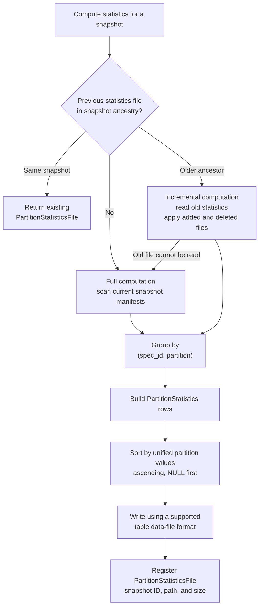
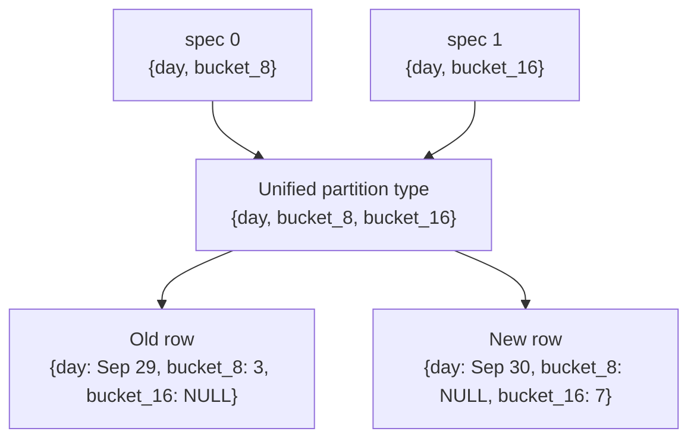

<!--
  Licensed to the Apache Software Foundation (ASF) under one
  or more contributor license agreements.  See the NOTICE file
  distributed with this work for additional information
  regarding copyright ownership.  The ASF licenses this file
  to you under the Apache License, Version 2.0 (the
  "License"); you may not use this file except in compliance
  with the License.  You may obtain a copy of the License at

    http://www.apache.org/licenses/LICENSE-2.0

  Unless required by applicable law or agreed to in writing,
  software distributed under the License is distributed on an
  "AS IS" BASIS, WITHOUT WARRANTIES OR CONDITIONS OF ANY
  KIND, either express or implied.  See the License for the
  specific language governing permissions and limitations
  under the License.
-->

# RFC: Partition Statistics

**Status:** Draft

**Target:** Apache Iceberg Rust (`iceberg-rust`)

## 1. Motivation and Scope

An Iceberg table may contain millions of data and delete files. Answering a
partition-level question directly from manifests requires reading every relevant
manifest entry and grouping the entries by partition. Repeating that work makes
metadata queries and maintenance planning expensive.

Partition statistics materialize that aggregation. For a particular snapshot,
the statistics file contains one row for each partition and partition spec. A
row summarizes data files, delete files, deletion vectors, and the snapshot that
last changed the partition. Consumers can use this compact file to find, for
example, partitions with many small files or many deletes without rescanning all
manifests.

Partition statistics are informational. They are not required to read a table,
plan a scan, or produce correct query results. A reader may ignore them. Each
snapshot may have at most one registered partition statistics file.

This RFC proposes support for:

- the `PartitionStatistics` row model and versioned schemas;
- reading partition statistics through `PartitionStatisticsScan`;
- full and incremental computation compatible with Java's
  `PartitionStatsHandler`;
- writing a sorted statistics file in a supported table data-file format; and
- registering the resulting `PartitionStatisticsFile` in table metadata.

Computing exact live row counts, automatically generating statistics during
every table write, and using partition statistics for data-file pruning are out
of scope.

## 2. Existing Support and Missing Pieces

Iceberg Rust already models `PartitionStatisticsFile`, including the snapshot
ID, file path, and file size. Table metadata can set, retrieve, and remove that
descriptor, and snapshot expiration removes descriptors belonging to expired
snapshots.

The following pieces are not yet implemented:

- the rows stored inside a partition statistics file;
- the versioned row schema and conversion to file-format schemas;
- reading and writing those rows;
- a partition statistics scan; and
- computation and registration of a new statistics file.

This RFC fills those gaps without changing the Iceberg table format.

## 3. Terminology and Java Compatibility

The implementation should follow the current Java names and semantics. In
particular, the row type is `PartitionStatistics`, not `PartitionStats`.

| Concept | Java name | Proposed Rust name |
| --- | --- | --- |
| One statistics row | `PartitionStatistics` | `PartitionStatistics` |
| Registered file descriptor | `PartitionStatisticsFile` | `PartitionStatisticsFile` |
| Statistics reader | `PartitionStatisticsScan` | `PartitionStatisticsScan` |
| Computation helper | `PartitionStatsHandler` | `PartitionStatsHandler` |

Serialized field names follow the Iceberg specification. Java exposes those
fields using camel-case getters, while Rust uses snake case. One exception is
`total_record_count`: the Java getter is `totalRecords()`.

The existing Rust descriptor field `statistics_path` is retained. It serializes
as `statistics-path`, while the equivalent Java descriptor exposes `path()`.

## 4. Architecture

The high-level workflow matches Java:



Computation and registration are separate responsibilities. The handler
computes and writes a file. The transaction action registers its descriptor in
table metadata after validating that it still applies to the target snapshot.

## 5. Partition Statistics Schema

The file contains one row for each unique `(spec_id, partition)` key. Field IDs,
types, requiredness, and meanings come from the Iceberg specification.

| ID | Stored field | Type | v1/v2 | v3 | Java getter | Description |
| ---: | --- | --- | --- | --- | --- | --- |
| 1 | `partition` | `struct` | Required | Required | `partition()` | Values represented using the unified partition type |
| 2 | `spec_id` | `int` | Required | Required | `specId()` | ID of the partition spec that produced the values |
| 3 | `data_record_count` | `long` | Required | Required | `dataRecordCount()` | Records across data files before applying deletes |
| 4 | `data_file_count` | `int` | Required | Required | `dataFileCount()` | Number of data files |
| 5 | `total_data_file_size_in_bytes` | `long` | Required | Required | `totalDataFileSizeInBytes()` | Combined size of data files |
| 6 | `position_delete_record_count` | `long` | Optional | Required | `positionDeleteRecordCount()` | Position deletes, including deletion-vector records |
| 7 | `position_delete_file_count` | `int` | Optional | Required | `positionDeleteFileCount()` | Position-delete files, excluding deletion vectors |
| 8 | `equality_delete_record_count` | `long` | Optional | Required | `equalityDeleteRecordCount()` | Records described by equality-delete files |
| 9 | `equality_delete_file_count` | `int` | Optional | Required | `equalityDeleteFileCount()` | Number of equality-delete files |
| 10 | `total_record_count` | `long` | Optional | Optional | `totalRecords()` | Exact live records after applying deletes, when known |
| 11 | `last_updated_at` | `long` | Optional | Optional | `lastUpdatedAt()` | Latest partition update time in milliseconds since the Unix epoch |
| 12 | `last_updated_snapshot_id` | `long` | Optional | Optional | `lastUpdatedSnapshotId()` | Snapshot that most recently changed the partition |
| 13 | `dv_count` | `int` | Not present | Required | `dvCount()` | Number of deletion vectors |

Iceberg uses signed `int` and `long` values, so the corresponding Rust counters
should use `i32` and `i64`. This also permits incremental computation to
represent decrements while merging a delta. A completed statistics file must
not contain negative counters.

For v3, `dv_count` has initial and write defaults of zero so a v3 reader can
read statistics that originated from a v2-compatible schema. The
`position_delete_record_count` includes records from deletion vectors, but
`position_delete_file_count` counts only position-delete files.

### 5.1 Exact Record Count

`total_record_count` is not generally equal to `data_record_count` minus the two
delete record counts. Delete records may not match live rows and different
delete mechanisms may overlap. Computing an exact value can require reading
table data.

To match the current Java `PartitionStatsHandler`, newly computed Rust rows
leave `total_record_count` as `NULL`. `PartitionStatisticsScan` must still expose
a non-null value written by another compatible implementation.

## 6. Partition Evolution

Partition specs can evolve. The `partition` struct therefore uses the unified
partition type: the union of every partition field that has appeared in any
table spec, ordered by partition field ID.



`spec_id` remains part of the aggregation key. Two rows with equal-looking
partition values but different specs must not be merged. Manifest partition
values are coerced into the unified type before they are written.

## 7. Computing Statistics

### 7.1 Full Computation

A full computation reads the target snapshot's manifests and aggregates live
manifest entries. Manifests may be processed concurrently, with each task
building a local map that is merged after processing.

For each live file:

- a data file increments `data_record_count`, `data_file_count`, and
  `total_data_file_size_in_bytes`;
- a position-delete file increments `position_delete_record_count` and
  `position_delete_file_count`;
- a deletion vector increments `position_delete_record_count` and `dv_count`;
  and
- an equality-delete file increments `equality_delete_record_count` and
  `equality_delete_file_count`.

The row's update timestamp and snapshot ID are taken from the newest snapshot
that added or removed a file for the partition.

### 7.2 Incremental Computation

If an ancestor of the target snapshot has a registered statistics file, the
handler can read that file as its base. It then examines manifests added by the
snapshots between the base and target:

- added live entries increment counters;
- deleted entries decrement counters; and
- entries already represented by the base file are not counted again.

If the previous file cannot be read or validated, the handler falls back to a
full computation. Full and incremental computation for the same snapshot must
produce equivalent rows.

The handler returns the existing descriptor without rewriting the file when the
target snapshot already has registered partition statistics.

### 7.3 Sorting and File Format

Rows are sorted by the unified `partition` struct in ascending order with nulls
first. Sorting allows readers to filter the statistics file efficiently.

Java writes the file using the table's default data-file format. Rust should
eventually provide the same behavior for every supported format. Format support
may be delivered incrementally, but unsupported configured formats must return
a clear error rather than silently choosing a different format.

A generated name should follow Java's collision-resistant pattern:

```text
partition-stats-<snapshot-id>-<uuid>.<extension>
```

## 8. Registration and Transaction Safety

After writing the file, the action registers this descriptor:

```text
PartitionStatisticsFile
├── snapshot_id
├── statistics_path
└── file_size_in_bytes
```

Registration uses the existing `SetPartitionStatistics` table update. The
statistics file is valid for readers only after its descriptor is committed to
table metadata.

The action must track the generated file as an owned artifact. If the metadata
commit definitively fails, the file may be deleted. If the catalog result is
unknown, cleanup must preserve the file because the descriptor may have been
committed. This follows the terminal cleanup rules in
`0003_stateful_transaction.md`.

On a retry, a file computed for an immutable target snapshot may be reused if
that snapshot remains valid in the refreshed table. Otherwise the action must
fail or recompute for a newly selected target according to its public API; it
must never register statistics under the wrong snapshot ID.

## 9. Reading Statistics

`PartitionStatisticsScan` reads the file registered for a selected snapshot and
returns `PartitionStatistics` rows. Following Java, a scan supports:

- `use_snapshot` to select a snapshot instead of the current snapshot;
- `filter` to evaluate an Iceberg expression against statistics rows;
- `case_sensitive`, which defaults to true, for resolving filter names; and
- `project` to read only the requested fields.

Fields referenced by a filter are included in the physical read even when they
are not part of the caller's projection. A scan must apply Iceberg field-ID
projection rather than relying only on field order or names.

When no snapshot is selected, the scan uses the current snapshot. If the table
has no current snapshot or the selected snapshot has no registered file, the
scan returns no rows rather than computing statistics implicitly. Selecting an
unknown snapshot is an error. Computation remains an explicit action.

## 10. Complete Example

Assume snapshot `9002` belongs to a v3 table partitioned by day. Its statistics
file could contain the following rows:

```yaml
- partition:
    day: "2026-09-29"
  spec_id: 0

  data_record_count: 3000
  data_file_count: 2
  total_data_file_size_in_bytes: 31457280

  # Includes records from position-delete files and deletion vectors.
  position_delete_record_count: 100
  # Counts position-delete files only; deletion vectors are separate.
  position_delete_file_count: 1
  dv_count: 1

  equality_delete_record_count: 20
  equality_delete_file_count: 1

  # Java does not calculate this during partition statistics computation.
  total_record_count: null

  last_updated_at: 1790640000000
  last_updated_snapshot_id: 8998

- partition:
    day: "2026-09-30"
  spec_id: 0

  data_record_count: 500
  data_file_count: 1
  total_data_file_size_in_bytes: 5242880

  position_delete_record_count: 0
  position_delete_file_count: 0
  dv_count: 0

  equality_delete_record_count: 0
  equality_delete_file_count: 0

  # Remains null even when the partition has no deletes.
  total_record_count: null

  last_updated_at: 1790726400000
  last_updated_snapshot_id: 9002
```

The table metadata registers the file separately:

```json
{
  "snapshot-id": 9002,
  "statistics-path": "s3://warehouse/table/metadata/partition-stats-9002-<uuid>.parquet",
  "file-size-in-bytes": 8192
}
```

Consumers can answer questions such as "which partitions have many small files"
or "which partitions have accumulated many deletes" by scanning these summary
rows instead of all manifest entries.

## 11. Compatibility and Rollout

The implementation can be delivered in stages:

1. Add the versioned `PartitionStatistics` model and schema tests.
2. Add file readers, writers, and `PartitionStatisticsScan` for the first
   supported format.
3. Add full computation and atomic registration.
4. Add incremental computation with full-computation fallback.
5. Add remaining table data-file formats supported by Iceberg Rust.

Files produced by Rust must be readable by Java, and files produced by Java
must be readable by Rust. Compatibility tests should exchange physical files,
not only compare in-memory schemas.

## 12. Risks and Mitigations

| Risk | Description | Mitigation |
| --- | --- | --- |
| Incorrect aggregation after partition evolution | Rows from different specs or struct layouts may be merged | Key by both spec ID and partition, and coerce values into the unified type |
| Corrupted incremental counts | A missing or duplicated delta can create incorrect or negative counters | Compare incremental output with full computation in tests and reject negative final counters |
| Incorrect delete interpretation | Deletion vectors may be counted as position-delete files | Include DV records in field 6, exclude DVs from field 7, and count them in field 13 |
| Stale statistics registration | A retry may attempt to attach a file to the wrong snapshot | Validate snapshot identity before commit and preserve it across safe retries |
| Orphaned statistics files | File writing happens before the catalog commit | Track generated files as action-owned artifacts and apply terminal cleanup rules |
| Cross-language drift | Rust names or requiredness may diverge from Java | Test field IDs, types, requiredness, serialized names, and Java-readable fixtures |

## 13. Test Plan

Tests should cover:

- v1/v2 and v3 schemas, including the v3 default for `dv_count`;
- all data, position-delete, equality-delete, and deletion-vector counters;
- the distinction between position-delete files and deletion vectors;
- `total_record_count` remaining null after Rust computation;
- update time and snapshot selection across multiple manifest entries;
- partition evolution and unified partition projection;
- sort order, including null-first behavior;
- equality of full and incremental results;
- fallback when a previous statistics file is invalid;
- rejection of negative completed counters;
- reading Java-produced files and Java reading Rust-produced files;
- registration, retry, definitive-failure cleanup, and unknown-result cleanup;
- snapshots without a registered statistics file; and
- unpartitioned tables and tables without a current snapshot.

## 14. Open Questions

1. Which physical format should be implemented first: Parquet, Avro, or both?
2. Should `PartitionStatsHandler` be public, or should users access computation
   only through a transaction action?
3. Should full computation ship before incremental computation, or should Java
   parity be required for the first release?
4. Which cross-language fixtures should be checked into the repository, and how
   should they be regenerated?

## 15. References

- [Iceberg partition statistics specification](https://iceberg.apache.org/spec/#partition-statistics)
- [Iceberg partition statistics file specification](https://iceberg.apache.org/spec/#partition-statistics-file)
- [Iceberg Rust issue #1102](https://github.com/apache/iceberg-rust/issues/1102)
- [Previous Iceberg Rust PR #1111](https://github.com/apache/iceberg-rust/pull/1111)
- [Java `PartitionStatistics`](https://github.com/apache/iceberg/blob/main/api/src/main/java/org/apache/iceberg/PartitionStatistics.java)
- [Java `PartitionStatsHandler`](https://github.com/apache/iceberg/blob/main/core/src/main/java/org/apache/iceberg/PartitionStatsHandler.java)

## 16. Conclusion

Partition statistics provide a compact, snapshot-specific view of partition
health without affecting table correctness. Matching Java's schema, naming, and
computation behavior gives Iceberg Rust interoperable files and a familiar API.
The existing metadata support supplies the registration foundation; this RFC
adds the row model, scan, computation, file I/O, and transaction-safe lifecycle
needed to make that support usable.
