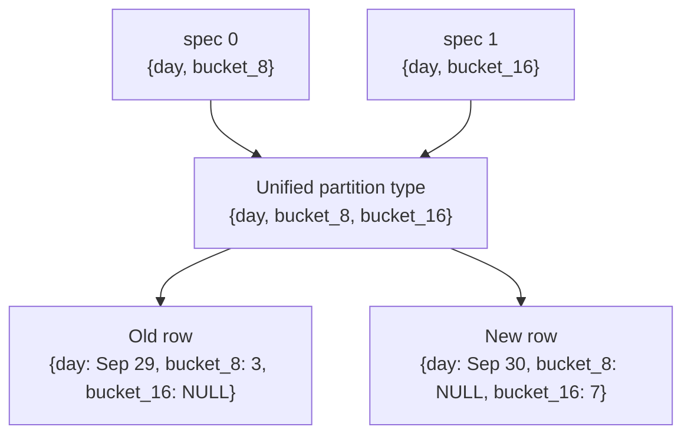

<!--
  Licensed to the Apache Software Foundation (ASF) under one
  or more contributor license agreements.  See the NOTICE file
  distributed with this work for additional information
  regarding copyright ownership.  The ASF licenses this file
  to you under the Apache License, Version 2.0 (the
  "License"); you may not use this file except in compliance
  with the License.  You may obtain a copy of the License at

    http://www.apache.org/licenses/LICENSE-2.0

  Unless required by applicable law or agreed to in writing,
  software distributed under the License is distributed on an
  "AS IS" BASIS, WITHOUT WARRANTIES OR CONDITIONS OF ANY
  KIND, either express or implied.  See the License for the
  specific language governing permissions and limitations
  under the License.
-->

# RFC: Partition Statistics

**Status:** Draft

**Target:** Apache Iceberg Rust (`iceberg-rust`)

## 1. Motivation and Scope

An Iceberg table may contain millions of data and delete files. Answering a partition-level question directly from manifests requires reading relevant entries and grouping them by partition. Repeating that work makes metadata queries and maintenance planning expensive.

Partition statistics materialize that aggregation. For a particular snapshot, the statistics file contains one row for each partition and partition spec. A row summarizes data files, delete files, deletion vectors, and available update history. Consumers can use this compact file to find partitions with many small files or many deletes without rescanning all manifests.

Partition statistics are informational. They are not required to read a table, plan a scan, or produce correct query results. A reader may ignore them. Each snapshot may have at most one registered partition statistics file.

This RFC proposes support for:

- the `PartitionStatistics` row model and versioned schemas;
- reading partition statistics through `PartitionStatisticsScan`;
- full and incremental computation based on Java's `PartitionStatsHandler`;
- writing a sorted statistics file in a supported table data-file format; and
- registering the resulting `PartitionStatisticsFile` in table metadata.

Computing exact live row counts, automatically generating statistics during every table write, and using partition statistics for data-file pruning are out of scope.

## 2. Existing Support and Missing Pieces

Iceberg Rust already models `PartitionStatisticsFile`, including the snapshot ID, file path, and file size. Table metadata can set, retrieve, and remove that descriptor, and snapshot expiration removes descriptors belonging to expired snapshots.

This RFC adds the missing row model, versioned schemas, file I/O, scan, and computation on top of that metadata support, without changing the Iceberg table format.

## 3. Terminology and Java Compatibility

The implementation follows Java's names, stored field definitions, counter arithmetic, and snapshot-selection rules. Differences in historical partition projection, validation, live-record-count handling, and transaction safety are described below. The row type is `PartitionStatistics`, not `PartitionStats`.

Java behavior in this RFC was checked against `apache/iceberg` commit [`f5484c40`](https://github.com/apache/iceberg/commit/f5484c409357e9995f2aadd60bd26735e45670f4), dated September 30, 2026.

| Concept | Java name | Proposed Rust name |
| --- | --- | --- |
| One statistics row | `PartitionStatistics` | `PartitionStatistics` |
| Registered file descriptor | `PartitionStatisticsFile` | `PartitionStatisticsFile` |
| Statistics reader | `PartitionStatisticsScan` | `PartitionStatisticsScan` |
| Computation helper | `PartitionStatsHandler` | `PartitionStatsHandler` |

Serialized field names follow the Iceberg specification. Java exposes those fields using camel-case getters, while Rust uses snake case. One exception is `total_record_count`: the Java getter is `totalRecords()`.

The existing Rust descriptor field `statistics_path` is retained. It serializes as `statistics-path`, while the equivalent Java descriptor exposes `path()`.

## 4. Architecture

The diagram shows Rust's computation flow for nonempty results. Errors and no-file outcomes are described in section 7.4.


Computation and registration are separate responsibilities. The handler computes and writes a file. The transaction action registers its descriptor in table metadata after validating that it still applies to the target snapshot.

## 5. Partition Statistics Schema

The file contains one row for each unique `(spec_id, partition)` key. Field IDs, types, requiredness, and meanings come from the Iceberg specification. The v1/v2 and v3 columns refer to Iceberg table-format versions.

| ID | Stored field | Type | v1/v2 | v3 | Java getter | Description |
| ---: | --- | --- | --- | --- | --- | --- |
| 1 | `partition` | `struct` | Required | Required | `partition()` | Values represented using the unified partition type |
| 2 | `spec_id` | `int` | Required | Required | `specId()` | ID of the partition spec that produced the values |
| 3 | `data_record_count` | `long` | Required | Required | `dataRecordCount()` | Records across data files before applying deletes |
| 4 | `data_file_count` | `int` | Required | Required | `dataFileCount()` | Number of data files |
| 5 | `total_data_file_size_in_bytes` | `long` | Required | Required | `totalDataFileSizeInBytes()` | Combined size of data files |
| 6 | `position_delete_record_count` | `long` | Optional | Required | `positionDeleteRecordCount()` | Position deletes, including deletion-vector records |
| 7 | `position_delete_file_count` | `int` | Optional | Required | `positionDeleteFileCount()` | Position-delete files, excluding deletion vectors |
| 8 | `equality_delete_record_count` | `long` | Optional | Required | `equalityDeleteRecordCount()` | Records described by equality-delete files |
| 9 | `equality_delete_file_count` | `int` | Optional | Required | `equalityDeleteFileCount()` | Number of equality-delete files |
| 10 | `total_record_count` | `long` | Optional | Optional | `totalRecords()` | Exact live records after applying deletes, when known |
| 11 | `last_updated_at` | `long` | Optional | Optional | `lastUpdatedAt()` | Latest known partition update time in milliseconds since the Unix epoch |
| 12 | `last_updated_snapshot_id` | `long` | Optional | Optional | `lastUpdatedSnapshotId()` | Snapshot associated with the latest known partition update |
| 13 | `dv_count` | `int` | Not present | Required | `dvCount()` | Number of deletion vectors |

Iceberg uses signed `int` and `long` values, so the corresponding Rust counters should use `i32` and `i64`. This permits incremental computation to represent decrements while merging a delta. A completed statistics file must not contain negative counters. Rejecting negative final counters is an additional Rust validation requirement; the Java handler does not perform this check before writing.

For v3, `dv_count` has initial and write defaults of zero so a v3 reader can read statistics that originated from a v2-compatible schema. The `position_delete_record_count` includes records from deletion vectors, but `position_delete_file_count` counts only position-delete files.

### 5.1 Exact Record Count

`total_record_count` is not generally equal to `data_record_count` minus the two delete record counts. Delete records may not match live rows and different delete mechanisms may overlap. Computing an exact value can require reading table data.

Java initializes fresh rows with `total_record_count` as `NULL`. Its incremental merge can retain a non-null value read from a previous statistics file, even when the delta has no exact live-record count.

Rust leaves `total_record_count` as `NULL` in every newly computed full or incremental file, clearing values inherited from an incremental base. This is an intentional difference from Java that avoids carrying a potentially stale live-record count into a new snapshot. Reading an existing file preserves a value supplied by another implementation. Same-snapshot descriptor reuse does not rewrite or clear that file.

## 6. Partition Evolution

Partition specs can evolve. As required by the Iceberg specification, Rust uses the full unified partition type: the union of all known partition fields across table specs, including fields whose source columns were dropped. Unified fields are optional, ordered by partition field ID, and use the most recent spec's name for each field.

Resolve each field's output type from its transform and compatible current or retained historical table schemas, using manifest partition schemas when needed. Apply valid Iceberg type promotion when reconciling types. If a required historical type cannot be resolved, return an error rather than substituting `Unknown` or discarding values.

In v1, a field replaced by the `void` transform keeps its historical non-void type. A field that was always void may use `int` when its source type is unavailable. Reject a reused field ID whose source column or non-void transform conflicts across specs.

Java's statistics paths use `Partitioning.partitionType(table)`, which excludes fields whose source columns are absent from the current schema. Rust retains these fields to follow the specification and preserve distinct historical partitions. Java's table-aware scan omits them; if every partition source column has been dropped, it rejects the resulting empty partition type.



Aggregation keys use `spec_id` and the original tuple for that spec. Two rows with equal-looking partition values but different specs must not be merged. Row values are coerced into the full unified type before writing. For incremental merging, reconstruct original per-spec tuples by partition field ID before comparing keys. If a base file omits information needed to recover those keys, it cannot support a safe merge and must trigger full computation.

## 7. Computing Statistics

### 7.1 Full Computation

A full computation reads all entries in the target snapshot's manifests. Live entries (`ADDED` or `EXISTING`) contribute counters; `DELETED` entries update available history without contributing counters. A partition represented only by deleted entries can therefore produce a zero-count row.

Manifests may be processed concurrently, with each task building a local map that is merged after processing.

For each live file:

- a data file increments `data_record_count`, `data_file_count`, and `total_data_file_size_in_bytes`;
- a position-delete file increments `position_delete_record_count` and `position_delete_file_count`;
- a deletion vector increments `position_delete_record_count` and `dv_count`; and
- an equality-delete file increments `equality_delete_record_count` and `equality_delete_file_count`.

Update history is best effort. Among the snapshots available for encountered entries, the row keeps the greatest timestamp and its associated snapshot ID. An expired snapshot cannot contribute its timestamp; both fields remain null if no update information is available. A full computation cannot recover changes no longer represented in the target manifests.

### 7.2 Incremental Computation

If an ancestor of the target snapshot has a registered statistics file, the handler can read that file as its base. It then examines manifests added by each snapshot between the base and target:

- `ADDED` entries increment counters;
- `DELETED` entries decrement counters; and
- `EXISTING` entries are skipped, including files added earlier in the incremental interval.

Rust validates that the base schema, keys, and counters support incremental merging. If reading fails or the base fails validation, the handler falls back to a full computation. Java falls back on failures while reading the base file; semantic base validation is an additional Rust requirement.

Incremental computation retains base rows, including rows whose counters reach zero, and preserves available update history. A full computation may omit a partition once its deleted entries disappear from current manifests. The two paths must agree on data and delete counters after treating absent partitions as zero, but their row sets and update history need not be identical. Tests compare normalized counter maps and check zero-count-row retention and history separately.

New incremental output clears inherited `total_record_count` values as described in section 5.1. The handler returns the existing descriptor without rewriting the file when the target snapshot already has registered partition statistics.

### 7.3 Sorting and File Format

Rows are sorted by the unified `partition` struct using Java's ascending, null-first sorting rule. Java currently evaluates filters after reading projected rows; sorting does not imply predicate pushdown in its statistics reader.

Java selects the table's default data-file format, but its statistics I/O currently supports Avro and Parquet, with Parquet requiring its optional module. These are the initial Rust interoperability targets. Support for other Rust table data-file formats can follow as an extension. An unsupported configured format must return a clear error rather than silently choosing another format.

A generated name should follow Java's collision-resistant pattern:

```text
partition-stats-<snapshot-id>-<uuid>.<extension>
```

### 7.4 Computation Outcomes

Computation returns `Result<Option<PartitionStatisticsFile>>`. It uses the current snapshot by default and permits explicit snapshot selection.

- No current snapshot, without an explicit selection, returns `Ok(None)`.
- An unknown selected snapshot returns an error.
- A table with no partitioned spec returns an error.
- An empty aggregation map returns `Ok(None)`, without writing a file.
- Writing a nonempty result requires a nonempty unified partition type; an empty type returns an error.

A snapshot with no live files can still produce a statistics file when deleted-only or retained zero-count rows remain. A no-file result requires no metadata registration.

## 8. Registration and Transaction Safety

After writing the file, the action registers this descriptor:

```text
PartitionStatisticsFile
├── snapshot_id
├── statistics_path
└── file_size_in_bytes
```

Registration uses the existing `SetPartitionStatistics` table update. The statistics file is valid for readers only after its descriptor is committed to table metadata.

Registration must not commit a descriptor for a target snapshot that expires concurrently. A local existence check alone is insufficient; the catalog commit must enforce this guarantee.

The following owned-artifact and retry-safety rules are Rust-specific requirements based on `0003_stateful_transaction.md`.

The action must track the generated file as an owned artifact. If the metadata commit definitively fails, the file may be deleted. If the catalog result is unknown, cleanup must preserve the file because the descriptor may have been committed. A reused registered file is not newly owned and must not be deleted by this action.

On a retry, a file computed for an immutable target snapshot may be reused if that snapshot remains valid in the refreshed table. Otherwise the action must fail or recompute for a newly selected target according to its public API; it must never register statistics under the wrong snapshot ID.

## 9. Reading Statistics

`PartitionStatisticsScan` reads the file registered for a selected snapshot and returns `PartitionStatistics` rows. Following Java, a scan supports:

- `use_snapshot` to select a snapshot instead of the current snapshot;
- `filter` to evaluate an Iceberg expression against statistics rows;
- `case_sensitive`, which defaults to true, for resolving filter names; and
- `project` to select fields by Iceberg field ID.

Both the physical read and the returned rows include projected fields plus fields referenced by the filter. Other unselected fields are `None`, even when the full on-disk schema marks them required. Rust row accessors must support this nullable projection result. A scan applies Iceberg field-ID projection rather than relying only on field order or names.

When no snapshot is selected, the scan uses the current snapshot. If the table has no current snapshot or the selected snapshot has no registered file, the scan returns no rows rather than computing statistics implicitly. Selecting an unknown snapshot is an error. Computation remains an explicit action.

## 10. Complete Example

Assume snapshot `9002` belongs to a v3 table partitioned by day. A newly computed Rust statistics file could contain the following rows:

```yaml
- partition:
    day: "2026-09-29"
  spec_id: 0

  data_record_count: 3000
  data_file_count: 2
  total_data_file_size_in_bytes: 31457280

  # Includes records from position-delete files and deletion vectors.
  position_delete_record_count: 100
  # Counts position-delete files only; deletion vectors are separate.
  position_delete_file_count: 1
  dv_count: 1

  equality_delete_record_count: 20
  equality_delete_file_count: 1

  # Java does not calculate this during partition statistics computation.
  total_record_count: null

  last_updated_at: 1790640000000
  last_updated_snapshot_id: 8998

- partition:
    day: "2026-09-30"
  spec_id: 0

  data_record_count: 500
  data_file_count: 1
  total_data_file_size_in_bytes: 5242880

  position_delete_record_count: 0
  position_delete_file_count: 0
  dv_count: 0

  equality_delete_record_count: 0
  equality_delete_file_count: 0

  # Remains null even when the partition has no deletes.
  total_record_count: null

  last_updated_at: 1790726400000
  last_updated_snapshot_id: 9002
```

The table metadata registers the file separately:

```json
{
  "snapshot-id": 9002,
  "statistics-path": "s3://warehouse/table/metadata/partition-stats-9002-<uuid>.parquet",
  "file-size-in-bytes": 8192
}
```

Consumers can answer questions such as "which partitions have many small files" or "which partitions have accumulated many deletes" by scanning these summary rows instead of all manifest entries.

## 11. Compatibility and Rollout

The implementation can be delivered in stages:

1. Add the versioned `PartitionStatistics` model and schema tests.
2. Add file readers, writers, and `PartitionStatisticsScan` for the first supported format.
3. Add full computation and atomic registration.
4. Add incremental computation with full-computation fallback.
5. Add remaining supported Rust table data-file formats as extensions beyond current Java statistics I/O.

Files in shared supported formats must use compatible stored schemas. Test interoperability with exchanged files, including Java-to-Rust reads and Rust-to-Java scans when Java can build a nonempty partition type. Also test Java's historical-field projection and empty-type rejection described in section 6.

Rust's historical-field retention follows the specification; its exact-count invalidation, base validation, and transaction cleanup are additional safety choices.

## 12. Risks and Mitigations

| Risk | Description | Mitigation |
| --- | --- | --- |
| Incorrect aggregation after partition evolution | Rows from different specs or struct layouts may be merged | Key by both spec ID and partition, and coerce values into the unified type |
| Corrupted incremental counts | A missing or duplicated delta can create incorrect or negative counters | Compare normalized counter maps with full computation and reject negative final counters |
| Incorrect delete interpretation | Deletion vectors may be counted as position-delete files | Include DV records in field 6, exclude DVs from field 7, and count them in field 13 |
| Stale statistics registration | A retry may use the wrong snapshot, or the target may expire concurrently | Preserve snapshot identity across retries and enforce target validity at catalog commit |
| Orphaned statistics files | File writing happens before the catalog commit | Track generated files as action-owned artifacts and apply terminal cleanup rules |
| Cross-language drift | Rust names or requiredness may diverge from Java | Test field IDs, types, requiredness, serialized names, and Java-readable fixtures |

## 13. Test Plan

Tests should cover:

- v1/v2 and v3 schemas, including the v3 default for `dv_count`;
- all data, position-delete, equality-delete, and deletion-vector counters;
- the distinction between position-delete files and deletion vectors;
- `total_record_count` remaining null after full computation and clearing imported totals in newly computed incremental output;
- scans and same-snapshot reuse preserving a non-null total from an existing file;
- update history from live and deleted entries, including unavailable expired snapshots;
- partition evolution, retained dropped-source fields, and reconstruction of original per-spec keys;
- historical type recovery from retained schemas or manifest partition schemas, valid type promotion, and errors for unresolved required types;
- v1 void replacements, void-only fields, and rejection of conflicting field-ID reuse;
- fallback when a projected base file loses information needed to distinguish historical partitions;
- Java scan projection after source-column drops and rejection when its active partition type becomes empty;
- returned projection including filter fields and other unselected fields being `None`;
- sort order, including null-first behavior;
- equality of normalized full and incremental counter maps;
- skipping `EXISTING` entries for files added earlier in the incremental interval;
- zero-count-row retention and differences in available history between computation paths;
- fallback when reading a previous statistics file fails or the base fails semantic validation;
- rejection of negative completed counters;
- reading Java-produced files and Java reading Rust-produced files where its scan is supported;
- registration, retry, definitive-failure cleanup, and unknown-result cleanup;
- concurrent target-snapshot expiration during registration leaving no descriptor for an expired snapshot;
- snapshots without a registered statistics file;
- no-file results for no current snapshot or an empty aggregation map;
- rejection of unknown computation snapshots, tables with no partitioned spec, and empty unified types when writing; and
- configured supported formats and clear errors for unsupported formats.

## 14. Open Questions

1. Which physical format should be implemented first: Parquet, Avro, or both?
2. Should `PartitionStatsHandler` be public, or should users access computation only through a transaction action?
3. Should full computation ship before incremental computation, or should both be required for the first release?
4. Which cross-language fixtures should be checked into the repository, and how should they be regenerated?

## 15. References

- [Iceberg partition statistics specification](https://iceberg.apache.org/spec/#partition-statistics)
- [Iceberg partition statistics file specification](https://iceberg.apache.org/spec/#partition-statistics-file)
- [Iceberg Rust issue #1102](https://github.com/apache/iceberg-rust/issues/1102)
- [Previous Iceberg Rust PR #1111](https://github.com/apache/iceberg-rust/pull/1111)
- [Original design proposal: Table level partition stats in Iceberg](https://docs.google.com/document/d/1vaufuD47kMijz97LxM67X8OX-W2Wq7nmlz3jRo8J5Qk/edit)
- [Original mailing-list proposal and discussion](https://lists.apache.org/thread/5pzyvncvz6td1vmf02o02ncknbvbzrs7)
- [Java implementation tracker](https://github.com/apache/iceberg/issues/8450)
- [Java `PartitionStatistics`](https://github.com/apache/iceberg/blob/f5484c409357e9995f2aadd60bd26735e45670f4/api/src/main/java/org/apache/iceberg/PartitionStatistics.java)
- [Java `PartitionStatsHandler`](https://github.com/apache/iceberg/blob/f5484c409357e9995f2aadd60bd26735e45670f4/core/src/main/java/org/apache/iceberg/PartitionStatsHandler.java)
- [Java `Partitioning`](https://github.com/apache/iceberg/blob/f5484c409357e9995f2aadd60bd26735e45670f4/core/src/main/java/org/apache/iceberg/Partitioning.java)
- [Java `BasePartitionStatisticsScan`](https://github.com/apache/iceberg/blob/f5484c409357e9995f2aadd60bd26735e45670f4/core/src/main/java/org/apache/iceberg/BasePartitionStatisticsScan.java)
- [Java statistics file-format support](https://github.com/apache/iceberg/blob/f5484c409357e9995f2aadd60bd26735e45670f4/core/src/main/java/org/apache/iceberg/InternalData.java)

## 16. Conclusion

Partition statistics provide a compact, snapshot-specific view of partitions without affecting table correctness. This RFC follows Java's stored schema and core computation flow, with explicit Rust safety differences. It adds the row model, scan, computation, file I/O, and transaction-safe lifecycle on top of existing metadata support.
