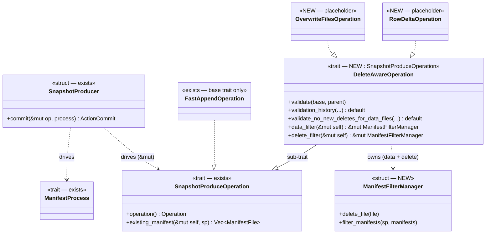

<!--
  Licensed to the Apache Software Foundation (ASF) under one
  or more contributor license agreements.  See the NOTICE file
  distributed with this work for additional information
  regarding copyright ownership.  The ASF licenses this file
  to you under the Apache License, Version 2.0 (the
  "License"); you may not use this file except in compliance
  with the License.  You may obtain a copy of the License at

    http://www.apache.org/licenses/LICENSE-2.0

  Unless required by applicable law or agreed to in writing,
  software distributed under the License is distributed on an
  "AS IS" BASIS, WITHOUT WARRANTIES OR CONDITIONS OF ANY
  KIND, either express or implied.  See the License for the
  specific language governing permissions and limitations
  under the License.
-->

# Design Document: Snapshot Conflict Validation

## 1. Problem Statement

Snapshot production on `main` only supports append-only operations. There is no
machinery for the operations that **remove existing files** from a table — delete,
overwrite, and rewrite. Those operations need two capabilities that append does not:

1. **Write-time conflict validation** — before writing a new snapshot, the commit must
   check the refreshed base table for concurrent changes that would make the pending
   operation incorrect (e.g. a concurrent commit that added delete files for data files
   this operation is about to rewrite).
2. **Manifest filtering** — instead of carrying existing manifests forward verbatim, a
   delete-class operation must rewrite manifests to drop the files it removes.

iceberg-java packages all of this into a single `MergingSnapshotProducer` base class via
implementation inheritance. Rust has no implementation inheritance, and the append path is
already factored differently. We need a shape that adds validation + filtering for
delete-class operations **without disturbing the append-only path** and without recreating
a Java-style inheritance chain.

This document defines the trait/struct structure for that shape. Concrete operations
(`OverwriteFiles`, `RowDelta`, `RewriteFiles`) and the `DeleteFileIndex` conflict-scoping
gap are out of scope here and left as placeholders.

## 2. Existing Architecture and Components

The snapshot-production machinery on `main` lives in `transaction/snapshot.rs` and
`transaction/append.rs`:

- **`SnapshotProducer`** (`snapshot.rs`) — a concrete struct that *drives* one operation
  plus one manifest process and writes the new snapshot (id generation, manifest writing,
  manifest-list writing, summary). Its `commit<OP, MP>(...)` method does **not** validate.
- **`SnapshotProduceOperation`** (`snapshot.rs`) — a plain trait with no supertrait,
  exposing `operation()`, `delete_entries()`, and `existing_manifest()`. `existing_manifest`
  today only *selects* which manifests to carry forward.
- **`ManifestProcess` + `DefaultManifestProcess`** (`snapshot.rs`) — a seam for
  merge/compaction of the manifest set. `DefaultManifestProcess` is a no-op pass-through.
- **`FastAppendOperation`** (`append.rs`) — the only `SnapshotProduceOperation` impl; it
  implements the base trait and nothing else.
- **`TransactionAction`** (`action.rs`) — `commit(self: Arc<Self>, table: &Table)`. The
  action is the object `Arc`-cloned and reused across `Transaction::do_commit` retries; the
  producer and operation are rebuilt from scratch on each attempt.

There is no validator trait, no `validate.rs`, no filter manager, and no producer-side
validation call anywhere on `main`.

## 3. Proposed Architecture



Key points:

- The new `DeleteAwareOperation` is an **additive sub-trait** of the existing
  `SnapshotProduceOperation`. Append-only operations implement only the base trait and carry
  none of the validation/filtering surface.
- `validate` is invoked by the **action** before it hands off to `SnapshotProducer::commit`,
  so validation precedes every write. The producer stays oblivious to validation.
- The producer drives the operation by `&mut` so the filter managers can mutate during
  manifest production. This is the one base-trait signature change: `existing_manifest`
  takes `&mut self`; `FastAppendOperation` absorbs it trivially.

## 4. Proposed Components

### 4.1 `DeleteAwareOperation` (new trait)

A sub-trait of `SnapshotProduceOperation`, implemented only by delete-class operations. It
provides three things:

- **`validate`** — the per-operation conflict check (real polymorphism; each operation
  implements its own).
- **Reusable validation helpers with default implementations** — `validation_history` and
  `validate_no_new_deletes_for_data_files`. A single `validate()` is not enough: each
  delete-class operation composes the same lower-level checks (scan the snapshots added since
  the validation window, find conflicting deletes for a set of data files). Putting these on
  the trait as defaults lets each `validate` reuse them instead of re-deriving the logic.
  (See `#2590` for the reference shape of these helpers.)
- **Filter accessors** — `data_filter` / `delete_filter` reach the operation's owned filter
  managers so the above can be wired without each implementor re-plumbing them.

```rust
// NEW — does not exist on main
trait DeleteAwareOperation: SnapshotProduceOperation {
    /// Per-operation conflict check against the refreshed base table, run before any write.
    /// Implemented per operation; composes the helpers below.
    async fn validate(&self, base: &Table, parent_snapshot_id: Option<i64>) -> Result<()>;

    /// Default helper: collect manifests + snapshot ids between two points, filtered by
    /// operation set and manifest content type. Reused by the checks below.
    async fn validation_history(
        &self,
        base: &Table,
        from_snapshot_id: Option<i64>,
        to_snapshot_id: i64,
        matching_operations: &HashSet<Operation>,
        content_type: ManifestContentType,
    ) -> Result<(Vec<ManifestFile>, HashSet<i64>)> {
        // default implementation
    }

    /// Default helper: fail if any delete added since `from_snapshot_id` targets the
    /// given data files.
    async fn validate_no_new_deletes_for_data_files(
        &self,
        base: &Table,
        from_snapshot_id: Option<i64>,
        to_snapshot_id: Option<i64>,
        data_files: &[DataFile],
    ) -> Result<()> {
        // default implementation, built on validation_history
    }

    /// Accessors to the operation's owned managers. Built up as the operation is
    /// constructed and mutated during manifest production.
    fn data_filter(&mut self) -> &mut ManifestFilterManager;
    fn delete_filter(&mut self) -> &mut ManifestFilterManager;
}
```

The managers are **owned fields on the operation**, populated incrementally as the action
builds the operation, e.g.:

```rust
struct RowDelta {
    data_filter: ManifestFilterManager,
    delete_filter: ManifestFilterManager,
    // ... added files, conflict-detection config, etc.
}

impl RowDelta {
    fn remove_rows(&mut self, file: DataFile) {
        self.delete_filter().delete_file(file);
    }
}

impl DeleteAwareOperation for RowDelta {
    async fn validate(&self, base: &Table, parent: Option<i64>) -> Result<()> {
        // composes the default helpers, e.g.
        self.validate_no_new_deletes_for_data_files(base, parent, None, &self.targets)
            .await
    }
    fn data_filter(&mut self) -> &mut ManifestFilterManager { &mut self.data_filter }
    fn delete_filter(&mut self) -> &mut ManifestFilterManager { &mut self.delete_filter }
}
```

Because the operation is rebuilt each commit attempt, the managers are reconstructed
deterministically per attempt from the action's stored inputs — no stale per-attempt state.

### 4.2 `ManifestFilterManager` (new struct)

A concrete struct (not a trait) that an operation owns — one for data manifests, one for
delete manifests. It accumulates which files/entries to drop and rewrites the affected
manifests during manifest production. Its only durable state is within a single filtering
pass, which matches the operation's per-attempt lifetime.

```rust
// NEW — concrete struct
struct ManifestFilterManager {
    // files/entries to drop, drop predicate, within-pass tracking, ...
}

impl ManifestFilterManager {
    /// Record a file for removal. `DataFile` covers both data and delete files, so the
    /// same entry point serves data-manifest and delete-manifest filtering.
    fn delete_file(&mut self, file: DataFile) { /* record removal */ }

    /// Rewrite the given manifests, dropping removed entries; writes rewritten
    /// manifests via a producer-provided helper.
    async fn filter_manifests(
        &mut self,
        sp: &mut SnapshotProducer<'_>,
        manifests: Vec<ManifestFile>,
    ) -> Result<Vec<ManifestFile>> { /* ... */ }
}
```

### 4.3 `SnapshotProducer` (existing — one signature change)

Stays a concrete driver. `commit` and `manifest_file` thread the operation by `&mut` so a
delete-class operation can run its filter managers inside `existing_manifest`. The
append-only path is unchanged in behavior.

```rust
// existing trait method, now &mut self
fn existing_manifest(
    &mut self,
    sp: &mut SnapshotProducer<'_>,
) -> impl Future<Output = Result<Vec<ManifestFile>>> + Send;
```

### 4.4 Action wiring (placeholder)

Delete-class actions opt into validation explicitly; append actions do neither.

```rust
// NEW delete-class action — placeholder
impl TransactionAction for OverwriteFilesAction {
    async fn commit(self: Arc<Self>, table: &Table) -> Result<ActionCommit> {
        let op = self.build_operation(); // build delete_aware_op
        op.validate(table, table.metadata().current_snapshot_id()).await?;
        let producer = SnapshotProducer::new(table, /* ... */);
        producer.commit(op, DefaultManifestProcess).await
    }
}

// FastAppendAction is unchanged: no validate, no DeleteAwareOperation.
```

### 4.5 Worked example: `RewriteFilesAction`

`RewriteFiles` replaces a set of existing files with a new, equivalent set (compaction). It
adds new files and deletes old ones in one `Replace` snapshot, and must validate that no new
row-level deletes have appeared for the data files it is rewriting since its starting
snapshot. The reference implementation is `#1606`; the field set, the builder split of added
/ deleted files by content type, the empty-file precondition checks, and the
`ignore_equality_deletes = data_sequence_number.is_some()` flag are taken directly from it.
The shape below keeps that behavior but expresses it through `DeleteAwareOperation` (rather
than `#1606`'s separate `SnapshotValidator` supertrait) and routes the removed files through
`ManifestFilterManager` (rather than carrying `deleted_*` vectors on `SnapshotProducer`).

```rust
// NEW — placeholder. Added/deleted files are split by content type, as in #1606.
pub struct RewriteFilesAction {
    commit_uuid: Option<Uuid>,
    key_metadata: Option<Vec<u8>>,
    snapshot_properties: HashMap<String, String>,
    added_data_files: Vec<DataFile>,
    added_delete_files: Vec<DataFile>,
    deleted_data_files: Vec<DataFile>,
    deleted_delete_files: Vec<DataFile>,
    data_sequence_number: Option<i64>,
    starting_snapshot_id: Option<i64>,
}

impl RewriteFilesAction {
    /// Split incoming files into data vs delete buckets (content type), as in #1606.
    pub fn add_data_files(mut self, files: impl IntoIterator<Item = DataFile>) -> Result<Self> {
        for f in files {
            match f.content_type() {
                DataContentType::Data => self.added_data_files.push(f),
                DataContentType::PositionDeletes | DataContentType::EqualityDeletes => {
                    self.added_delete_files.push(f)
                }
            }
        }
        Ok(self)
    }

    pub fn delete_files(mut self, files: impl IntoIterator<Item = DataFile>) -> Result<Self> {
        for f in files {
            match f.content_type() {
                DataContentType::Data => self.deleted_data_files.push(f),
                DataContentType::PositionDeletes | DataContentType::EqualityDeletes => {
                    self.deleted_delete_files.push(f)
                }
            }
        }
        Ok(self)
    }

    pub fn set_starting_snapshot_id(mut self, id: i64) -> Self { /* ... */ self }
    pub fn set_data_sequence_number(mut self, seq: i64) -> Self { /* ... */ self }
    // set_commit_uuid / set_key_metadata / set_snapshot_properties omitted

    /// Rebuild a fresh operation per attempt; the managers are repopulated
    /// deterministically from the action's stored inputs (survives do_commit retries).
    fn build_operation(&self) -> RewriteFilesOperation {
        let mut op = RewriteFilesOperation {
            deleted_data_files: self.deleted_data_files.clone(),
            deleted_delete_files: self.deleted_delete_files.clone(),
            starting_snapshot_id: self.starting_snapshot_id,
            data_sequence_number: self.data_sequence_number,
            data_filter: ManifestFilterManager::default(),
            delete_filter: ManifestFilterManager::default(),
        };
        // Removed files become filter-manager removals (DataFile covers both kinds).
        for f in &self.deleted_data_files {
            op.data_filter.delete_file(f.clone());
        }
        for f in &self.deleted_delete_files {
            op.delete_filter.delete_file(f.clone());
        }
        op
    }
}

pub struct RewriteFilesOperation {
    deleted_data_files: Vec<DataFile>,
    deleted_delete_files: Vec<DataFile>,
    starting_snapshot_id: Option<i64>,
    data_sequence_number: Option<i64>,
    data_filter: ManifestFilterManager,
    delete_filter: ManifestFilterManager,
}

impl SnapshotProduceOperation for RewriteFilesOperation {
    fn operation(&self) -> Operation { Operation::Replace }

    async fn existing_manifest(
        &mut self,
        sp: &mut SnapshotProducer<'_>,
    ) -> Result<Vec<ManifestFile>> {
        let Some(snapshot) = sp.table.metadata().current_snapshot() else {
            return Ok(vec![]);
        };
        let manifests = snapshot
            .load_manifest_list(sp.table.file_io(), sp.table.metadata())
            .await?
            .entries()
            .to_vec();

        // Each manager rewrites the manifests it owns, dropping the removed files and
        // re-emitting the survivors (this is #1606's per-manifest rewrite loop, moved
        // into ManifestFilterManager::filter_manifests).
        let (data, deletes): (Vec<_>, Vec<_>) =
            manifests.into_iter().partition(|m| m.content == ManifestContentType::Data);
        let mut out = self.data_filter.filter_manifests(sp, data).await?;
        out.extend(self.delete_filter.filter_manifests(sp, deletes).await?);
        Ok(out)
    }
}

impl DeleteAwareOperation for RewriteFilesOperation {
    async fn validate(&self, base: &Table, parent_snapshot_id: Option<i64>) -> Result<()> {
        // Precondition checks (verbatim intent from #1606).
        if self.deleted_data_files.is_empty() && self.deleted_delete_files.is_empty() {
            return Err(Error::new(ErrorKind::DataInvalid, "Files to delete cannot be empty"));
        }

        // If data files are being rewritten, there must be no new row-level deletes for
        // them since the starting snapshot. ignore_equality_deletes follows #1606: when a
        // data_sequence_number is pinned, only positional deletes count as conflicts.
        if !self.deleted_data_files.is_empty() {
            self.validate_no_new_deletes_for_data_files(
                base,
                self.starting_snapshot_id,
                parent_snapshot_id,
                &self.deleted_data_files,
                self.data_sequence_number.is_some(),
            )
            .await?;
        }
        Ok(())
    }

    fn data_filter(&mut self) -> &mut ManifestFilterManager { &mut self.data_filter }
    fn delete_filter(&mut self) -> &mut ManifestFilterManager { &mut self.delete_filter }
}

#[async_trait]
impl TransactionAction for RewriteFilesAction {
    async fn commit(self: Arc<Self>, table: &Table) -> Result<ActionCommit> {
        let op = self.build_operation();

        // STEP 1 — conflict validation before any write.
        op.validate(table, table.metadata().current_snapshot_id()).await?;

        // STEP 2 — produce the snapshot. The producer drives the op by &mut so the
        // filter managers can rewrite manifests inside existing_manifest.
        let producer = SnapshotProducer::new(
            table,
            self.commit_uuid.unwrap_or_else(Uuid::now_v7),
            self.key_metadata.clone(),
            self.snapshot_properties.clone(),
            self.added_data_files.clone(),
        );
        producer.commit(op, DefaultManifestProcess).await
    }
}
```

This exercises every component: `validate` runs the precondition checks then composes the
`validate_no_new_deletes_for_data_files` default helper (which itself calls
`validation_history`); the two `ManifestFilterManager`s take the removed data and delete
files via `delete_file` and rewrite the carried-forward manifests in `existing_manifest`
(driven by `&mut`); and `FastAppend` continues to need none of it.

